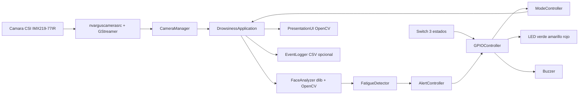
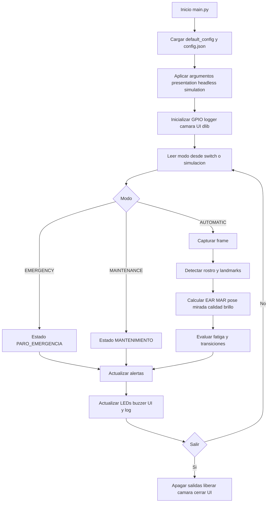

# Sistema de deteccion de somnolencia en Jetson Nano

## Overall del proyecto

Este proyecto implementa un sistema de deteccion de somnolencia para conductores usando una NVIDIA Jetson Nano 4 GB, una camara CSI IMX219-77IR, OpenCV y dlib. La aplicacion toma video en tiempo real, detecta el rostro, extrae 68 puntos faciales, calcula metricas de fatiga y activa alertas visuales/auditivas mediante una interfaz de OpenCV y, si se habilita, salidas GPIO fisicas.

El objetivo es identificar senales como ojos cerrados por tiempo prolongado, PERCLOS elevado, bostezos, cabeceo, perdida de rostro y mirada fuera del frente. El sistema trabaja en tres modos: automatico, mantenimiento y paro de emergencia.

## Que se hizo

Se construyo una aplicacion modular en Python con los siguientes componentes:

- `main.py`: punto de entrada. Carga `config.json`, procesa argumentos de linea de comandos y arranca la aplicacion.
- `src/application.py`: orquesta camara, analisis facial, detector de fatiga, UI, GPIO, logging y cierre limpio.
- `src/camera.py`: captura video desde camara CSI usando un pipeline GStreamer con `nvarguscamerasrc` y entrega el ultimo frame disponible en un hilo separado.
- `src/face_analyzer.py`: usa dlib para detectar rostro y puntos faciales. Calcula EAR, MAR, pose de cabeza, direccion de mirada, brillo y calidad de deteccion.
- `src/fatigue_detector.py`: convierte las metricas faciales en estados del sistema como `NORMAL`, `PARPADEO`, `POSIBLE_SOMNOLENCIA`, `ALERTA`, `ALERTA_CRITICA` y `ROSTRO_NO_DETECTADO`.
- `src/calibration.py`: calibra el umbral EAR de sesion a partir de muestras con ojos abiertos.
- `src/alert_controller.py`: traduce estados de fatiga a patrones de LEDs y tonos PWM para buzzer pasivo.
- `src/gpio_controller.py`: controla GPIO fisico en Jetson o modo simulado, incluyendo PWM para buzzer pasivo.
- `src/mode_controller.py`: administra los modos `AUTOMATIC`, `MAINTENANCE` y `EMERGENCY`.
- `src/presentation_ui.py`: muestra la interfaz grafica con video, landmarks, metricas, estado, LEDs virtuales y atajos de teclado.
- `src/event_logger.py`: registra transiciones de estado en CSV cuando el logging esta habilitado.
- `src/shutdown_manager.py`: maneja cierre por `Ctrl+C`, `SIGTERM`, tecla de salida o cierre de ventana.

Tambien se incluye el modelo `models/shape_predictor_68_face_landmarks.dat`, necesario para estimar los puntos faciales.

## Cambios recientes incorporados

Los ultimos cambios del proyecto quedaron concentrados principalmente en la logica de ejecucion, la interfaz y la configuracion:

- Se agrego control de modo mediante un switch fisico de tres estados con topologia `on_off_on`.
- El modo del sistema ahora puede venir de GPIO fisico o de simulacion por teclado.
- Se agregaron estados operativos explicitos: `AUTOMATIC`, `MAINTENANCE` y `EMERGENCY`.
- En modo mantenimiento se suspende la alerta auditiva y queda activo el LED amarillo.
- En paro de emergencia se apaga el buzzer y queda activo el LED rojo.
- La interfaz muestra fuente de modo, hardware activo, FPS de captura/analisis, tiempo de analisis por frame, tiempo de ejecucion, luminosidad, calidad de deteccion, conteo de parpadeos, posible bostezo, posible cabeceo y LEDs virtuales.
- Se agregaron controles por teclado para simular los tres modos: `1` automatico, `2` mantenimiento y `3` paro de emergencia.
- Se agrego reconexion basica de camara con `reconnect_attempts`.
- Se agrego medicion separada de FPS de captura y FPS de analisis.
- Se agrego periodo de recuperacion despues de alertas mediante `recovery_seconds`.
- Se agrego deteccion temporal de parpadeos, bostezos, cabeceo, mirada desviada y rostro no detectado.
- La configuracion base en `src/application.py` y `config.json` ya incluye secciones para camara, dlib, preprocesamiento, fatiga, GPIO, buzzer, LEDs, switch, interfaz y logging.

Nota: `switch.debounce_ms` y `switch.center_mode` ya existen en `config.json`. En la implementacion actual la lectura del switch usa entradas con pull-up/pull-down de Jetson.GPIO, pero no aplica una rutina de debounce por software; la posicion central se interpreta como `MAINTENANCE`, que coincide con el valor configurado actualmente.

## Arquitectura del sistema



## Flujo de ejecucion



## Como funciona

1. `main.py` carga la configuracion base desde `src/application.py` y la sobreescribe con `config.json`.
2. Se inicializan GPIO, logger, analizador facial, detector de fatiga, camara y UI.
3. `CameraManager` abre la camara CSI con GStreamer y captura frames en un hilo separado.
4. En cada ciclo, la aplicacion lee el modo activo, toma el frame mas reciente y lo analiza.
5. `FaceAnalyzer` convierte el frame a escala de grises, aplica preprocesamiento y localiza el rostro.
6. Si hay rostro, se calculan:
   - EAR: relacion de apertura ocular.
   - MAR: relacion de apertura de boca.
   - PERCLOS: porcentaje temporal de ojos cerrados en una ventana movil.
   - Pose de cabeza: pitch, yaw y roll.
   - Mirada estimada: centro, izquierda, derecha, arriba, abajo o desconocida.
   - Calidad de deteccion y brillo medio.
7. `FatigueDetector` evalua las metricas y cambia el estado del sistema segun los umbrales configurados.
8. `AlertController` activa LEDs y tonos del buzzer pasivo segun el estado.
9. `PresentationUI` dibuja el video, los landmarks y el panel de informacion.
10. Al salir, se apagan salidas GPIO, se libera la camara, se cierra el logger y se destruyen ventanas OpenCV.

## Estados principales

- `NORMAL`: indicadores dentro de rango.
- `PARPADEO`: cierre ocular breve dentro del rango esperado de parpadeo.
- `POSIBLE_SOMNOLENCIA`: advertencia preventiva por cierre sostenido, PERCLOS alto, bostezo con evidencia secundaria, cabeceo o mirada desviada.
- `ALERTA`: cierre ocular prolongado o PERCLOS de alerta.
- `ALERTA_CRITICA`: cierre ocular critico.
- `ROSTRO_NO_DETECTADO`: no se detecta rostro durante el tiempo configurado.
- `MANTENIMIENTO`: modo de mantenimiento, con alerta auditiva suspendida.
- `PARO_EMERGENCIA`: modo de paro de emergencia.
- `ERROR`: fallo no recuperable durante ejecucion.

## Modos de operacion

El sistema trabaja con tres modos de alto nivel:

- `AUTOMATIC`: modo normal de deteccion. Analiza video, calcula metricas y activa alertas segun el estado de fatiga.
- `MAINTENANCE`: modo de mantenimiento. El detector reporta `MANTENIMIENTO`, el buzzer se mantiene apagado y se enciende el LED amarillo.
- `EMERGENCY`: paro de emergencia. El detector reporta `PARO_EMERGENCIA`, el buzzer se mantiene apagado y se enciende el LED rojo.

La fuente del modo puede ser:

- Simulada: teclas `1`, `2` y `3` en la interfaz.
- Fisica: switch de tres estados conectado a GPIO cuando `gpio.enabled: true`, `gpio.simulation_mode: false` y `switch.enabled: true`.

## Switch de tres estados

El switch configurado es de tipo `on_off_on`. No se usan tres entradas digitales; se usan dos entradas GPIO:

- Posicion superior: activa `switch.auto_board_pin` y selecciona `AUTOMATIC`.
- Posicion central: ninguna entrada activa; el sistema selecciona `MAINTENANCE`.
- Posicion inferior: activa `switch.emergency_board_pin` y selecciona `EMERGENCY`.

Con la configuracion actual:

```json
"switch": {
  "enabled": false,
  "topology": "on_off_on",
  "auto_board_pin": 35,
  "emergency_board_pin": 37,
  "center_mode": "MAINTENANCE",
  "active_low": true,
  "debounce_ms": 100
}
```

Como `active_low` esta en `true`, cada entrada se considera activa cuando el pin lee `0`. Jetson.GPIO configura esas entradas con `PUD_UP`, por lo que el comun del switch debe ir a GND y cada extremo debe ir a su GPIO correspondiente.

Tabla de posiciones:

| Posicion del switch | Pin 35 AUTO | Pin 37 EMERGENCY | Modo resultante |
| --- | --- | --- | --- |
| AUTO | GND / activo | abierto / inactivo | `AUTOMATIC` |
| Centro | abierto / inactivo | abierto / inactivo | `MAINTENANCE` |
| EMERGENCY | abierto / inactivo | GND / activo | `EMERGENCY` |

## Manual de instalacion

### Requisitos de hardware

- NVIDIA Jetson Nano 4 GB.
- Camara CSI compatible con `nvarguscamerasrc`, por ejemplo IMX219-77IR.
- Opcional: buzzer pasivo de tres pines y LEDs conectados a GPIO.
- Opcional: switch fisico para modo automatico, mantenimiento y paro de emergencia.

### Diagrama general de conexion

```text
Jetson Nano 40-pin header

Camara CSI IMX219-77IR
  Camara ribbon cable  --->  Conector CSI de Jetson Nano

Salidas de alerta
  Pin 29 BOARD  --->  Resistencia 220-330 ohm  --->  Anodo LED verde
  Pin 31 BOARD  --->  Resistencia 220-330 ohm  --->  Anodo LED amarillo
  Pin 32 BOARD  --->  Resistencia 220-330 ohm  --->  Anodo LED rojo
  Catodos LEDs  --->  GND

Buzzer pasivo de tres pines
  Pin 33 BOARD  --->  SIG / S / I/O del buzzer
  3.3V o 5V     --->  VCC del buzzer, segun especificacion del modulo
  GND           --->  GND del buzzer

Switch ON-OFF-ON de tres posiciones
  Comun switch  --->  GND
  Extremo AUTO  --->  Pin 35 BOARD
  Extremo PARO  --->  Pin 37 BOARD
  Centro fisico --->  Sin contacto; queda en MAINTENANCE por software
```

### Diagrama del switch de tres estados

```text
Configuracion active_low=true

                 Switch ON-OFF-ON

        AUTO           CENTRO          EMERGENCY
         |               |                 |
         v               v                 v

      Pin 35          abierto           Pin 37
        |                                  |
        +---------o   comun   o-----------+
                  \    GND    /
                   \         /
                    +-------+
                       |
                      GND

Lectura esperada:
  Pin 35 en bajo, pin 37 alto  -> AUTOMATIC
  Pin 35 alto, pin 37 alto     -> MAINTENANCE
  Pin 35 alto, pin 37 bajo     -> EMERGENCY
```

### Diagrama de LEDs

```text
Modo active_high=true

Pin 29 BOARD ----[220-330 ohm]----|>|---- GND   LED verde
Pin 31 BOARD ----[220-330 ohm]----|>|---- GND   LED amarillo
Pin 32 BOARD ----[220-330 ohm]----|>|---- GND   LED rojo

El pin GPIO entrega nivel alto para encender el LED.
No conectar un LED sin resistencia limitadora.
```

### Diagrama de buzzer pasivo de tres pines

```text
Buzzer pasivo / modulo PWM de 3 pines

Jetson Nano BOARD 33  --->  SIG / S / I/O
Jetson Nano GND       --->  GND / -
Jetson Nano 3.3V/5V   --->  VCC / +, segun especificacion del modulo

El pin 33 ya no se usa como salida digital simple; ahora entrega PWM.
El tono depende de la frecuencia generada por software.
```

Notas:

- Si el modulo acepta 3.3V en la entrada de senal, conectar SIG directamente al pin 33.
- Si el modulo requiere senal de 5V, usar adaptacion de nivel para no forzar el GPIO de Jetson.
- Compartir siempre GND entre Jetson y el modulo.
- No conectar un buzzer pasivo de dos terminales directamente a GPIO si su corriente excede lo permitido; usar modulo o transistor driver.

Advertencias de hardware:

- Confirmar el pinout fisico de la Jetson Nano antes de energizar el circuito.
- No alimentar cargas directamente desde GPIO si exceden la corriente permitida.
- Compartir tierra entre Jetson, buzzer y cualquier fuente externa.
- Usar resistencias en LEDs y respetar el voltaje/corriente del modulo de buzzer pasivo.
- La numeracion del proyecto es `BOARD`, no `BCM`.

### Requisitos de software

- JetPack instalado y funcional.
- Python 3.
- OpenCV con soporte GStreamer.
- dlib.
- NumPy.
- Jetson.GPIO si se usara GPIO fisico.

Nota importante: `requirements.txt` esta vacio actualmente. Eso significa que la instalacion de dependencias no esta documentada ni automatizada desde pip. En Jetson normalmente conviene instalar OpenCV desde JetPack o paquetes del sistema, porque compilar OpenCV/dlib desde cero puede tardar mucho y consumir mucha memoria.

### Preparar el entorno

Desde la carpeta del proyecto:

```bash
cd /home/rafael/Documentos/tt2_drowsiness_jetson
source .venv/bin/activate
```

Verificar que el modelo exista:

```bash
ls models/shape_predictor_68_face_landmarks.dat
```

Verificar que la camara CSI funciona en la Jetson:

```bash
python3 main.py --presentation --simulation
```

Si la camara no abre, revisar conexion fisica, habilitacion de camara, JetPack, permisos y que el pipeline `nvarguscamerasrc` funcione.

## Manual de inicio

### Ejecutar con interfaz y hardware simulado

Este modo es el recomendado para pruebas iniciales, porque no requiere GPIO fisico activo:

```bash
python3 main.py --presentation --simulation
```

### Ejecutar sin interfaz

Util para pruebas en segundo plano o cuando no hay escritorio grafico:

```bash
python3 main.py --headless --simulation
```

### Ejecutar con configuracion personalizada

```bash
python3 main.py --config config.json --presentation
```

### Ejecutar con GPIO fisico

Editar `config.json` y cambiar:

```json
"gpio": {
  "enabled": true,
  "simulation_mode": false,
  "numbering": "BOARD"
}
```

Tambien habilitar el switch si se usara:

```json
"switch": {
  "enabled": true
}
```

Despues ejecutar:

```bash
python3 main.py --presentation
```

En Jetson puede ser necesario ejecutar con permisos adecuados para GPIO.

### Habilitar PWM nativo en BOARD 33

En Jetson Nano, BOARD 33 corresponde a PWM2. Primero habilitar `pwm2 (33)`
con `sudo /opt/nvidia/jetson-io/jetson-io.py`, guardar y reiniciar.

En L4T 32.7.6 el pin puede seguir bajo control GPIO aunque Jetson-IO y sysfs
muestren PWM2 correctamente. El proyecto incluye un inicializador especifico
para Tegra210 que aplica los registros necesarios y deja el buzzer low-trigger
en reposo HIGH al arrancar:

```bash
sudo install -m 755 scripts/configure_pwm2_jetson_nano.sh /usr/local/sbin/tt2-configure-pwm2
sudo install -m 644 systemd/tt2-pwm2-pinmux.service /etc/systemd/system/
sudo systemctl daemon-reload
sudo systemctl enable --now tt2-pwm2-pinmux.service
```

Comprobar el servicio y despues ejecutar la prueba:

```bash
systemctl status tt2-pwm2-pinmux.service --no-pager
python3 main.py --gpio-self-test
```

La prueba debe mostrar `Backend buzzer: PWM nativo` y terminar con codigo
cero. El programa no vuelve automaticamente a `software_pwm`.

## Manual de uso

Con la interfaz abierta, el panel lateral muestra el estado actual, motivo, EAR, umbral EAR, tiempo de ojos cerrados, PERCLOS, MAR, pose de cabeza, mirada, FPS, estado del buzzer, frecuencia activa y LEDs virtuales.

Teclas disponibles:

- `1`: cambiar a modo automatico simulado.
- `2`: cambiar a modo mantenimiento simulado.
- `3`: cambiar a modo paro de emergencia simulado.
- `C`: iniciar calibracion del umbral EAR.
- `L`: mostrar u ocultar landmarks.
- `I`: mostrar u ocultar panel de informacion.
- `M`: silenciar o reactivar buzzer.
- `P`: pausar o reanudar visualizacion.
- `R`: reiniciar metricas temporales del detector.
- `Q` o `Esc`: salir.

### Calibracion

Para calibrar:

1. Sentarse frente a la camara con iluminacion estable.
2. Presionar `C`.
3. Mirar al frente con ojos abiertos durante aproximadamente 4 segundos.
4. Si hay suficientes muestras estables, el sistema ajusta el umbral EAR de sesion.

Si la calibracion falla, puede deberse a rostro mal encuadrado, poca luz, exceso de movimiento o landmarks inestables.

## Configuracion principal

El archivo `config.json` concentra los parametros del sistema.

### Camara

- `capture_width` y `capture_height`: resolucion de captura de la camara.
- `processing_width` y `processing_height`: resolucion usada por OpenCV para analizar frames.
- `fps`: cuadros por segundo solicitados.
- `flip_method`: orientacion de imagen en el pipeline GStreamer.

### dlib

- `predictor_path`: ruta del modelo de 68 landmarks.
- `upsample`: aumenta sensibilidad del detector, pero consume mas CPU.
- `detection_interval_frames`: cada cuantos frames se redetecta el rostro.
- `use_correlation_tracker`: usa tracker entre detecciones para reducir carga.

### Fatiga

- `ear_threshold`: umbral base de ojos cerrados.
- `prealert_closed_seconds`: segundos para advertencia preventiva.
- `alert_closed_seconds`: segundos para alerta.
- `critical_closed_seconds`: segundos para alerta critica.
- `perclos_window_seconds`: ventana temporal para PERCLOS.
- `perclos_warning_threshold` y `perclos_alert_threshold`: umbrales de PERCLOS.
- `mar_threshold`: umbral de bostezo.
- `head_nod_pitch_threshold`: umbral de cabeceo por inclinacion.
- `gaze_away_warning_seconds`: tiempo de mirada desviada para advertencia.
- `no_face_warning_seconds`: tiempo sin rostro para advertencia.

### GPIO

Los pines estan en numeracion `BOARD`:

- Buzzer pasivo PWM, senal: pin 33.
- LED verde: pin 29.
- LED amarillo: pin 31.
- LED rojo: pin 32.
- Switch automatico: pin 35.
- Switch emergencia: pin 37.

Para ejecutar sin hardware, usar esta configuracion simulada:

```json
"gpio": {
  "enabled": false,
  "simulation_mode": true,
  "numbering": "BOARD"
},
"buzzer": {
  "enabled": true,
  "type": "pwm_native",
  "board_pin": 33,
  "active_high": false,
  "muted": false,
  "idle_frequency": 3000,
  "pwm_duty_cycle": 50,
  "pwm_chip": 0,
  "pwm_channel": 2,
  "min_frequency": 2000,
  "max_frequency": 5000
},
"switch": {
  "enabled": false
}
```

Para usar hardware real:

```json
"gpio": {
  "enabled": true,
  "simulation_mode": false,
  "numbering": "BOARD"
},
"buzzer": {
  "enabled": true,
  "type": "pwm_native",
  "board_pin": 33,
  "active_high": false,
  "muted": false,
  "idle_frequency": 3000,
  "pwm_duty_cycle": 50,
  "pwm_chip": 0,
  "pwm_channel": 2,
  "min_frequency": 2000,
  "max_frequency": 5000
},
"switch": {
  "enabled": true,
  "topology": "on_off_on",
  "auto_board_pin": 35,
  "emergency_board_pin": 37,
  "center_mode": "MAINTENANCE",
  "active_low": true,
  "debounce_ms": 100
}
```

Antes de conectar hardware real, confirmar pinout, resistencias, niveles logicos y consumo de corriente. No conectar cargas directamente si superan lo soportado por el GPIO.

### Buzzer pasivo y niveles de alerta

El MH-FMD/YL-44 es un buzzer pasivo low-level trigger. Necesita una portadora
de 2 a 5 kHz y su estado silencioso es HIGH. Con `buzzer.type: "pwm_native"`,
`GPIOController` programa PWM2 mediante sysfs: usa 50 % para emitir tono y
100 % para callar. El canal permanece habilitado al apagar y durante cleanup,
porque `PWM.stop()` deja LOW y activaria este modulo.

#### Diagnostico del problema de sonido irregular

El problema observado no se debia principalmente a la carga de la camara,
OpenCV o dlib. Se encontraron dos causas combinadas:

1. Aunque `pwm2 (33)` estaba seleccionado en Jetson-IO, BOARD 33 no estaba
   entregando la senal PWM fisica. En L4T 32.7.6 fue necesario configurar
   adicionalmente los registros de pinmux/PWM2. Mientras faltaba esa
   configuracion, el buzzer solo producia un `tic` en los cambios de nivel.
2. El modulo MH-FMD/YL-44 es pasivo y de disparo por nivel bajo. Necesita una
   onda cuadrada de aproximadamente 2 a 5 kHz para producir un tono; LOW lo
   activa y HIGH lo silencia. `Jetson.GPIO.PWM.stop()` deshabilitaba PWM2 y
   dejaba la salida en LOW, por lo que el buzzer podia quedar sonando de forma
   continua despues de detener el tono.

La solucion aplicada habilita correctamente PWM2 y controla el canal mediante
`/sys/class/pwm`. Para emitir un tono se usa un ciclo de trabajo del 50 % y para
silenciarlo se usa 100 %, que mantiene la salida en HIGH. El canal permanece
habilitado incluso durante el apagado y la limpieza del controlador; no se debe
usar `PWM.stop()` ni ejecutar `GPIO.cleanup()` sobre BOARD 33 mientras se use
este modulo. De esta forma, la generacion de la portadora queda en el hardware
PWM y no depende de la regularidad del loop de Python bajo la carga de vision.

Backends disponibles:


- `pwm_native`: recomendado para el buzzer pasivo en BOARD 33; requiere PWM2
  habilitado en el pinmux.
- `active`: para un buzzer activo controlado unicamente con ON/OFF.
- `software_pwm`: se conserva para diagnostico, pero no es adecuado para la
  ejecucion principal con vision activa.

Asignacion de niveles:

- Nivel de alerta 1: estado `POSIBLE_SOMNOLENCIA`.
- Nivel de alerta 2: estado `ALERTA`.
- Nivel de alerta 3: estado `ALERTA_CRITICA`.

Patrones implementados:

- Nivel 1: `2500 Hz`, `200 ms ON`, `1000 ms OFF`, `3` repeticiones.
  Despues queda en silencio hasta que cambie el estado.
- Nivel 2: `3500 Hz`, `200 ms ON`, `300 ms OFF`, `3` repeticiones;
  pausa de `900 ms` y repeticion mientras continue la condicion.
- Nivel 3: `4500 Hz`, `150 ms ON`, `150 ms OFF`, `5` repeticiones;
  pausa de `600 ms` y repeticion mientras continue la condicion.

### Patrones de alerta

| Estado | LED verde | LED amarillo | LED rojo | Buzzer |
| --- | --- | --- | --- | --- |
| `INICIALIZANDO` | Secuencia | Secuencia | Secuencia | Apagado |
| `NORMAL` / `PARPADEO` | Encendido | Apagado | Apagado | Apagado |
| `POSIBLE_SOMNOLENCIA` | Apagado | Parpadeo lento | Apagado | Nivel 1: 2500 Hz, 200 ms ON / 1000 ms OFF, 3 repeticiones |
| `ROSTRO_NO_DETECTADO` | Apagado | Parpadeo rapido | Apagado | Apagado |
| `ALERTA` | Apagado | Apagado | Parpadeo medio | Nivel 2: 3500 Hz, 200 ms ON / 300 ms OFF, 3 repeticiones, pausa 900 ms |
| `ALERTA_CRITICA` | Apagado | Apagado | Parpadeo rapido | Nivel 3: 4500 Hz, 150 ms ON / 150 ms OFF, 5 repeticiones, pausa 600 ms |
| `MANTENIMIENTO` | Apagado | Encendido | Apagado | Apagado |
| `PARO_EMERGENCIA` | Apagado | Apagado | Encendido | Apagado |
| `ERROR` | Apagado | Apagado | Doble parpadeo | Apagado |

### Logging

Para habilitar registro de eventos, cambiar en `config.json`:

```json
"logging": {
  "enabled": true,
  "events_only": true,
  "path": "logs/events.csv"
}
```

El logger guarda transiciones de estado con timestamp, modo, motivo, metricas principales, FPS, buzzer, frecuencia del buzzer y LEDs activos.

## Optimizacion para Jetson Nano 4 GB

La configuracion actual ya incluye varias decisiones razonables para Jetson Nano:

- Captura a 1280x720, pero procesamiento a 640x360.
- `upsample` en `0`, lo cual evita una carga alta en dlib.
- `detection_interval_frames` en `5`, por lo que no se redetecta el rostro en cada frame.
- `use_correlation_tracker` en `true`, lo que reduce costo entre detecciones.
- `appsink drop=true max-buffers=1 sync=false`, lo que evita acumulacion de frames viejos.
- Hilo dedicado de captura para no bloquear el analisis.

Con esas decisiones, el proyecto esta moderadamente optimizado para Jetson Nano. No obstante, no se puede afirmar que este suficientemente optimizado sin medir FPS real, temperatura y uso de CPU/GPU en tu Jetson, porque dlib con 68 landmarks es pesado para ese hardware.

### Recomendacion practica

Para considerar que esta suficientemente optimizado, verifica en la Jetson:

- `FPS captura/analisis` estable en la UI.
- Analisis idealmente cerca de 15 FPS o mas para una alerta fluida.
- Temperatura sin throttling durante una prueba de 10 a 20 minutos.
- Retardo bajo entre cierre de ojos y alerta.

Puedes monitorear la Jetson con:

```bash
tegrastats
```

### Ajustes si va lenta

Si el analisis baja demasiado:

1. Reducir `processing_width` y `processing_height` a `480x270`.
2. Subir `detection_interval_frames` de `5` a `8` o `10`.
3. Mantener `upsample` en `0`.
4. Desactivar landmarks visuales con `L` durante uso normal.
5. Ejecutar en modo headless si no necesitas UI.
6. Desactivar CLAHE si la iluminacion es buena:

```json
"preprocessing": {
  "use_clahe": false
}
```

7. Usar modo de energia maximo en Jetson Nano antes de pruebas largas:

```bash
sudo nvpmodel -m 0
sudo jetson_clocks
```

### Limitaciones actuales de optimizacion

- dlib no aprovecha plenamente la GPU de Jetson Nano en esta implementacion.
- El predictor de 68 landmarks pesa alrededor de 99 MB y puede ser costoso para CPU.
- `requirements.txt` no documenta dependencias, lo que dificulta reproducir el entorno.
- No hay pruebas automatizadas ni script de benchmark incluido.
- `CameraManager.get_latest_frame()` copia cada frame; es seguro, pero agrega algo de costo.

### Conclusion sobre optimizacion

Para tu hardware objetivo, Jetson Nano 4 GB, la base esta bien orientada y usa parametros conservadores. La parte mas pesada es dlib. Si en pruebas reales el analisis se mantiene sobre 15 FPS y no hay throttling termico, la optimizacion es suficiente para un prototipo funcional. Si cae por debajo de 10 FPS o hay mucho retardo, conviene bajar resolucion de procesamiento, aumentar el intervalo de deteccion o migrar la deteccion facial/landmarks a una alternativa acelerada por TensorRT o MediaPipe optimizado para Jetson.

## Problemas comunes

### No abre la camara

- Revisar cable CSI y orientacion.
- Probar la camara con herramientas de Jetson/GStreamer.
- Confirmar que OpenCV tiene soporte GStreamer.
- Revisar `sensor_id` y `flip_method` en `config.json`.

### No encuentra el predictor facial

Confirmar que existe:

```bash
models/shape_predictor_68_face_landmarks.dat
```

Si se mueve el archivo, actualizar `dlib.predictor_path` en `config.json`.

### Muchas falsas alertas

- Ejecutar calibracion con `C`.
- Ajustar `ear_threshold`.
- Mejorar iluminacion y posicion de camara.
- Revisar que el rostro ocupe suficiente area del frame.

### GPIO no responde

- Confirmar `gpio.enabled: true` y `gpio.simulation_mode: false`.
- Revisar permisos de ejecucion.
- Confirmar numeracion `BOARD`.
- Revisar cableado y resistencias.

