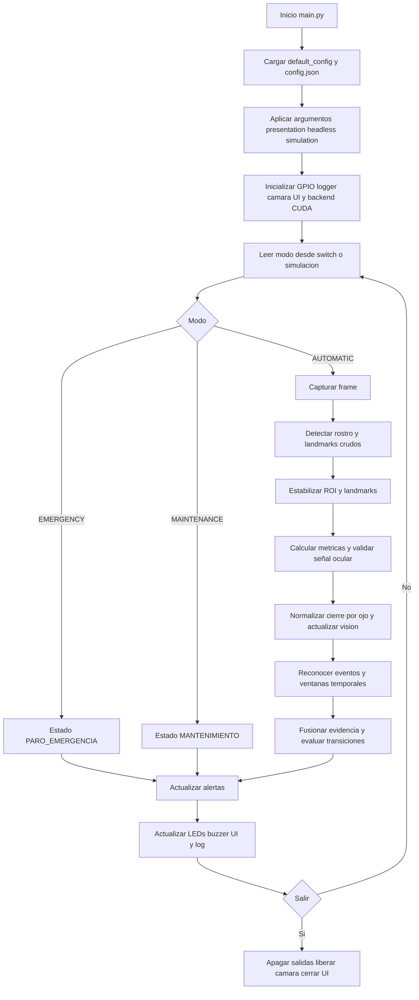
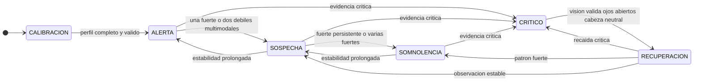
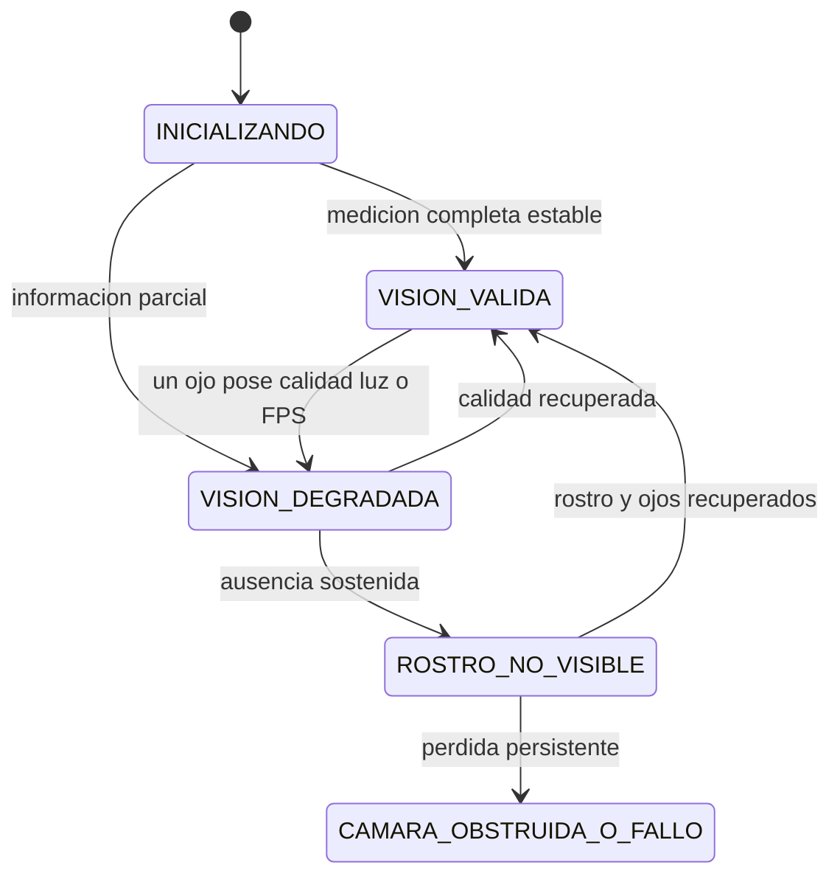

# Sistema de deteccion de somnolencia en Jetson Nano

## Overall del proyecto

Este proyecto implementa un sistema de deteccion de somnolencia para conductores usando una NVIDIA Jetson Nano 4 GB, una camara CSI IMX219-77IR, OpenCV y dlib. La aplicacion toma video en tiempo real, detecta el rostro, extrae 68 puntos faciales, calcula metricas de fatiga y activa alertas visuales/auditivas mediante una interfaz de OpenCV y, si se habilita, salidas GPIO fisicas.

El objetivo es identificar senales como ojos cerrados por tiempo prolongado, PERCLOS elevado, bostezos, cabeceo, perdida de rostro y mirada fuera del frente. El sistema trabaja en tres modos: automatico, mantenimiento y paro de emergencia.

## Que se hizo

Se construyo una aplicacion modular en Python con los siguientes componentes:

- `main.py`: punto de entrada. Carga `config.json`, procesa argumentos de linea de comandos y arranca la aplicacion.
- `src/application.py`: orquesta camara, analisis facial, detector de fatiga, UI, GPIO, logging y cierre limpio.
- `src/camera.py`: captura CSI con `nvarguscamerasrc`, NVMM y `nvvidconv`;
  entrega BGRx directo y publica el ultimo frame desde un hilo separado.
- `src/face_detector.py`: selecciona dlib CNN CUDA, OpenCV DNN CUDA FP16 o
  dlib HOG CPU, con fallback automatico y telemetria del backend activo.
- `src/face_analyzer.py`: estima 68 puntos faciales, estabiliza ROI y landmarks,
  calcula EAR por ojo, MAR, pose, mirada, brillo, nitidez y confiabilidad.
- `src/temporal_events.py`: normaliza el cierre por ojo, reconoce ciclos de
  parpadeo/bostezo/cabeceo y mantiene ventanas incrementales rápidas, medias y
  largas, incluida PERCLOS con cobertura válida.
- `src/vision_reliability.py`: mantiene la máquina paralela de disponibilidad
  de medición, separada del estado de somnolencia.
- `src/fatigue_detector.py`: fusiona eventos débiles, fuertes y críticos con
  temporización monotónica, memoria e histéresis en `CALIBRACION`, `ALERTA`,
  `SOSPECHA`, `SOMNOLENCIA`, `CRITICO` y `RECUPERACION`.
- `src/calibration.py`: captura tres referencias geométricas por ojo y un basal
  dinámico de parpadeos, valida calidad y persiste un perfil versionado.
- `src/alert_controller.py`: traduce estados de fatiga a patrones de LEDs y tonos PWM para buzzer pasivo.
- `src/gpio_controller.py`: controla GPIO fisico en Jetson o modo simulado, incluyendo PWM para buzzer pasivo.
- `src/mode_controller.py`: administra los modos `AUTOMATIC`, `MAINTENANCE` y `EMERGENCY`.
- `src/presentation_ui.py`: muestra la interfaz grafica con video, landmarks, metricas, estado, LEDs virtuales y atajos de teclado.
- `src/event_logger.py`: registra en CSV, con buffer, transiciones, eventos,
  métricas temporales, visión y salida de alertas.
- `src/shutdown_manager.py`: maneja cierre por `Ctrl+C`, `SIGTERM`, tecla de salida o cierre de ventana.

Los modelos se instalan localmente con `scripts/setup_v3_models.sh`: predictor
de 68 landmarks, detector CNN de dlib y SSD Caffe FP16 para el respaldo de
OpenCV. El script verifica sus hashes SHA-256 y `models/` se mantiene fuera de
Git.

## Cambios recientes incorporados

Los ultimos cambios del proyecto quedaron concentrados principalmente en la logica de ejecucion, la interfaz y la configuracion:

- Se agrego control de modo mediante un switch fisico de tres estados con topologia `on_off_on`.
- El modo del sistema ahora puede venir de GPIO fisico o de simulacion por teclado.
- Se agregaron estados operativos explicitos: `AUTOMATIC`, `MAINTENANCE` y `EMERGENCY`.
- En modo mantenimiento se suspende la alerta auditiva y queda activo el LED amarillo.
- En paro de emergencia se apaga el buzzer y queda activo el LED rojo.
- La interfaz muestra fuente de modo, hardware activo, FPS de captura/analisis, tiempo de analisis por frame, tiempo de ejecucion, luminosidad, calidad de deteccion, conteo de parpadeos, posible bostezo, posible cabeceo y LEDs virtuales.
- Se agregaron controles por teclado para simular los tres modos: `1` automatico, `2` mantenimiento y `3` paro de emergencia.
- Se agrego reconexion basica de camara con `reconnect_attempts`.
- Se agrego medicion separada de FPS de captura y FPS de analisis.
- Se agregaron escalas de 3, 25 y 60 segundos con colas acotadas y tiempo
  monotónico, independientes de los FPS.
- Se separaron medición, normalización, eventos, métricas, decisión y actuadores.
- La captura entrega BGRx directamente desde `nvvidconv`, eliminando
  `videoconvert` del camino CPU.
- La deteccion facial usa GPU CUDA y cambia automaticamente a un respaldo si
  el backend preferido no puede arrancar o falla durante la ejecucion.
- La interfaz muestra backend activo, aceleracion GPU y causa del fallback.
- Se estabilizaron el ROI y los landmarks para evitar reajustes bruscos por
  redetección o vibración del vehículo.
- Se separaron EAR crudo y filtrado, con mediana, histéresis y confirmaciones
  temporales distintas para cierre y apertura.
- Se agregó validación ocular por nitidez, tamaño, simetría entre ojos, calidad
  facial y yaw. Los cuadros no confiables se retienen brevemente y no se
  interpretan automáticamente como ojos abiertos.
- La calibración abierto/reducido/cerrado usa medianas por ojo, cobertura,
  dispersión y pose; después obtiene el basal de parpadeos natural o voluntario.
- El perfil válido se guarda de forma atómica y un intento fallido no lo
  sobrescribe; la observación iniciada bloquea el monitoreo hasta completarse.
- La interfaz muestra umbrales de cierre/apertura y diagnóstico de señal ocular
  para poder distinguir un patrón temporal compatible con fatiga visual de
  desenfoque u oclusión.

Nota: `switch.debounce_ms` y `switch.center_mode` ya existen en `config.json`. En la implementacion actual la lectura del switch usa entradas con pull-up/pull-down de Jetson.GPIO, pero no aplica una rutina de debounce por software; la posicion central se interpreta como `MAINTENANCE`, que coincide con el valor configurado actualmente.

## Arquitectura del sistema

```mermaid
flowchart LR
    CAM[Camara CSI IMX219-77IR] --> GStreamer[NVMM + nvarguscamerasrc + nvvidconv]
    GStreamer --> BGRX[BGRx 640x360]
    BGRX --> CameraManager[CameraManager latest-only]
    CameraManager --> App[DrowsinessApplication]
    App --> Backend[dlib CNN CUDA]
    Backend --> FaceAnalyzer[FaceAnalyzer 68 landmarks]
    Backend -. fallback .-> Reserva[OpenCV CUDA FP16 o HOG CPU]
    Reserva --> FaceAnalyzer
    FaceAnalyzer --> Raw[EAR por ojo MAR pose y calidad]
    Raw --> Normalizer[Cierre normalizado por ojo]
    Normalizer --> Events[Eventos y ventanas 3 25 60 s]
    Raw --> Vision[Confiabilidad de vision]
    Events --> FatigueDetector[Maquina de somnolencia]
    Vision --> FatigueDetector
    Switch[Switch 3 estados] --> GPIOController[GPIOController]
    GPIOController --> ModeController[ModeController]
    ModeController --> App
    FatigueDetector --> AlertController[AlertController]
    AlertController --> GPIOController
    GPIOController --> LEDs[LED verde amarillo rojo]
    GPIOController --> Buzzer[Buzzer]
    App --> UI[PresentationUI OpenCV]
    App --> Logger[EventLogger CSV opcional]
```



## Flujo de ejecucion



## Como funciona

1. `main.py` carga la configuracion base desde `src/application.py` y la sobreescribe con `config.json`.
2. Se inicializan GPIO, logger, analizador facial, detector de fatiga, camara y UI.
3. `CameraManager` abre la camara CSI con GStreamer, recibe BGRx directamente
   de `nvvidconv` y captura frames en un hilo separado.
4. En cada ciclo, la aplicacion lee el modo activo, toma el frame mas reciente y lo analiza.
5. `FaceAnalyzer` convierte BGRx a gris y localiza el rostro con el backend
   acelerado disponible. Las redetecciones se fusionan con el ROI seguido y
   los landmarks se separan en traslación global y forma local para reducir
   saltos sin impedir que el seguimiento acompañe movimientos reales.
6. Si hay rostro, se calculan:
   - EAR crudo y EAR filtrado: relación de apertura ocular antes y después de
     la mediana temporal.
   - MAR: relacion de apertura de boca.
   - PERCLOS: porcentaje temporal de ojos cerrados en una ventana movil.
   - Pose de cabeza: pitch, yaw y roll.
   - Mirada estimada: centro, izquierda, derecha, arriba, abajo o desconocida.
   - Calidad de detección, nitidez ocular, diferencia entre ambos ojos y brillo.
7. La señal ocular se valida por calidad, tamaño, nitidez, simetría y yaw. Una
   observación válida pasa por histéresis y confirmación temporal; una inválida
   conserva brevemente el último estado en lugar de forzar ojos abiertos.
8. `FatigueDetector` evalúa las métricas y cambia el estado del sistema según
   los umbrales personales o de respaldo.
9. `AlertController` activa LEDs y tonos del buzzer pasivo segun el estado.
10. `PresentationUI` dibuja el video, los landmarks y el panel de informacion.
11. Al salir, se apagan salidas GPIO, se libera la camara, se cierra el logger y se destruyen ventanas OpenCV.

## Estados principales

- `CALIBRACION`: no existe todavía un perfil completo y válido; las alertas de
  somnolencia permanecen desactivadas.
- `ALERTA`: vigilancia normal respecto al basal personal.
- `SOSPECHA`: evidencia temprana, ambigua o multimodal que debe observarse.
- `SOMNOLENCIA`: patrón temporal consistente de deterioro visual.
- `CRITICO`: cierre ocular crítico o combinación grave compatible con una
  posible pérdida momentánea de vigilancia. No es confirmación clínica.
- `RECUPERACION`: observación pegajosa posterior a un estado crítico.
- `MANTENIMIENTO`: modo de mantenimiento, con alerta auditiva suspendida.
- `PARO_EMERGENCIA`: modo de paro de emergencia.
- `ERROR`: fallo no recuperable durante ejecucion.

En paralelo se informa `INICIALIZANDO`, `VISION_VALIDA`, `VISION_DEGRADADA`,
`ROSTRO_NO_VISIBLE` o `CAMARA_OBSTRUIDA_O_FALLO`. Estos estados describen la
medición, no la fatiga.

### Diagrama de la maquina de estados



Un evento crítico interrumpe cualquier permanencia mínima. `CRITICO` nunca baja
directamente a `ALERTA`: exige visión válida, ojos abiertos y cabeza neutral,
pasa a `RECUPERACION`, después a `SOSPECHA` y finalmente a `ALERTA`. La pérdida
de visión conserva el estado previo sin inventar cierre ni acumular PERCLOS.

| Origen | Destino | Condición resumida |
| --- | --- | --- |
| Cualquier estado operativo | `CRITICO` | Cierre profundo continuo, cierre con caída de cabeza, cabeceo con ojos cerrados o repetición grave |
| `ALERTA` | `SOSPECHA` | Una evidencia fuerte o dos débiles de modalidades diferentes |
| `ALERTA` | `SOMNOLENCIA` | Al menos dos evidencias fuertes simultáneas |
| `SOSPECHA` | `SOMNOLENCIA` | Dos fuertes o una fuerte persistente durante el tiempo configurado |
| `SOMNOLENCIA` | `SOSPECHA` | Ausencia estable de evidencia durante `somnolence_clear_seconds` |
| `CRITICO` | `RECUPERACION` | Retención mínima cumplida, visión válida, apertura y postura neutrales sostenidas |
| `RECUPERACION` | `SOMNOLENCIA` | Reaparece una evidencia fuerte no crítica |
| `RECUPERACION` | `SOSPECHA` | Estabilidad durante la ventana de observación |
| `SOSPECHA` | `ALERTA` | Estabilidad sostenida durante `suspicion_clear_seconds` |

No se usa una suma ilimitada de puntos. Cada evento se clasifica por modalidad
y severidad; las colas temporales caducan y una señal débil repetida no puede
dominar indefinidamente. Dos evidencias débiles sólo cuentan si pertenecen a
modalidades diferentes.

### Máquina paralela de visión



Con un único ojo fiable se permite una medición degradada si
`allow_single_eye=true`, pero por defecto no se genera evidencia crítica a
partir de un solo ojo. Sin ojos válidos, el tiempo de cierre y PERCLOS no
avanzan. Una pérdida persistente se reporta como fallo de supervisión: con los
datos actuales no es posible distinguir de forma fiable una cámara tapada de
un asiento vacío.


## Modos de operacion

El sistema trabaja con tres modos de alto nivel:

- `AUTOMATIC`: modo normal de deteccion. Analiza video, calcula metricas y activa alertas segun el estado de fatiga.
- `MAINTENANCE`: modo de mantenimiento. El detector reporta `MANTENIMIENTO`, el buzzer se mantiene apagado y se enciende el LED amarillo.
- `EMERGENCY`: paro de emergencia. El detector reporta `PARO_EMERGENCIA`, el buzzer se mantiene apagado y se enciende el LED rojo.

La fuente del modo puede ser:

- Simulada: teclas `1`, `2` y `3` en la interfaz.
- Fisica: switch de tres estados conectado a GPIO cuando `gpio.enabled: true`, `gpio.simulation_mode: false` y `switch.enabled: true`.

## Switch de tres estados

El switch configurado es de tipo `on_off_on`. No se usan tres entradas digitales; se usan dos entradas GPIO:

- Posicion superior: activa `switch.auto_board_pin` y selecciona `AUTOMATIC`.
- Posicion central: ninguna entrada activa; el sistema selecciona `MAINTENANCE`.
- Posicion inferior: activa `switch.emergency_board_pin` y selecciona `EMERGENCY`.

Con la configuracion actual:

```json
"switch": {
  "enabled": false,
  "topology": "on_off_on",
  "auto_board_pin": 35,
  "emergency_board_pin": 37,
  "center_mode": "MAINTENANCE",
  "active_low": true,
  "debounce_ms": 100
}
```

Como `active_low` esta en `true`, cada entrada se considera activa cuando el pin lee `0`. Jetson.GPIO configura esas entradas con `PUD_UP`, por lo que el comun del switch debe ir a GND y cada extremo debe ir a su GPIO correspondiente.

Tabla de posiciones:

| Posicion del switch | Pin 35 AUTO | Pin 37 EMERGENCY | Modo resultante |
| --- | --- | --- | --- |
| AUTO | GND / activo | abierto / inactivo | `AUTOMATIC` |
| Centro | abierto / inactivo | abierto / inactivo | `MAINTENANCE` |
| EMERGENCY | abierto / inactivo | GND / activo | `EMERGENCY` |

## Manual de instalacion

### Requisitos de hardware

- NVIDIA Jetson Nano 4 GB.
- Camara CSI compatible con `nvarguscamerasrc`, por ejemplo IMX219-77IR.
- Opcional: buzzer pasivo de tres pines y LEDs conectados a GPIO.
- Opcional: switch fisico para modo automatico, mantenimiento y paro de emergencia.

### Diagrama general de conexion

```text
Jetson Nano 40-pin header

Camara CSI IMX219-77IR
  Camara ribbon cable  --->  Conector CSI de Jetson Nano

Salidas de alerta
  Pin 29 BOARD  --->  Resistencia 220-330 ohm  --->  Anodo LED verde
  Pin 31 BOARD  --->  Resistencia 220-330 ohm  --->  Anodo LED amarillo
  Pin 32 BOARD  --->  Resistencia 220-330 ohm  --->  Anodo LED rojo
  Catodos LEDs  --->  GND

Buzzer pasivo de tres pines
  Pin 33 BOARD  --->  SIG / S / I/O del buzzer
  3.3V o 5V     --->  VCC del buzzer, segun especificacion del modulo
  GND           --->  GND del buzzer

Switch ON-OFF-ON de tres posiciones
  Comun switch  --->  GND
  Extremo AUTO  --->  Pin 35 BOARD
  Extremo PARO  --->  Pin 37 BOARD
  Centro fisico --->  Sin contacto; queda en MAINTENANCE por software
```

### Diagrama del switch de tres estados

```text
Configuracion active_low=true

                 Switch ON-OFF-ON

        AUTO           CENTRO          EMERGENCY
         |               |                 |
         v               v                 v

      Pin 35          abierto           Pin 37
        |                                  |
        +---------o   comun   o-----------+
                  \    GND    /
                   \         /
                    +-------+
                       |
                      GND

Lectura esperada:
  Pin 35 en bajo, pin 37 alto  -> AUTOMATIC
  Pin 35 alto, pin 37 alto     -> MAINTENANCE
  Pin 35 alto, pin 37 bajo     -> EMERGENCY
```

### Diagrama de LEDs

```text
Modo active_high=true

Pin 29 BOARD ----[220-330 ohm]----|>|---- GND   LED verde
Pin 31 BOARD ----[220-330 ohm]----|>|---- GND   LED amarillo
Pin 32 BOARD ----[220-330 ohm]----|>|---- GND   LED rojo

El pin GPIO entrega nivel alto para encender el LED.
No conectar un LED sin resistencia limitadora.
```

### Diagrama de buzzer pasivo de tres pines

```text
Buzzer pasivo / modulo PWM de 3 pines

Jetson Nano BOARD 33  --->  SIG / S / I/O
Jetson Nano GND       --->  GND / -
Jetson Nano 3.3V/5V   --->  VCC / +, segun especificacion del modulo

El pin 33 ya no se usa como salida digital simple; ahora entrega PWM.
El tono depende de la frecuencia generada por software.
```

Notas:

- Si el modulo acepta 3.3V en la entrada de senal, conectar SIG directamente al pin 33.
- Si el modulo requiere senal de 5V, usar adaptacion de nivel para no forzar el GPIO de Jetson.
- Compartir siempre GND entre Jetson y el modulo.
- No conectar un buzzer pasivo de dos terminales directamente a GPIO si su corriente excede lo permitido; usar modulo o transistor driver.

Advertencias de hardware:

- Confirmar el pinout fisico de la Jetson Nano antes de energizar el circuito.
- No alimentar cargas directamente desde GPIO si exceden la corriente permitida.
- Compartir tierra entre Jetson, buzzer y cualquier fuente externa.
- Usar resistencias en LEDs y respetar el voltaje/corriente del modulo de buzzer pasivo.
- La numeracion del proyecto es `BOARD`, no `BCM`.

### Requisitos de software

- JetPack instalado y funcional.
- Python 3.
- OpenCV con soporte GStreamer.
- dlib.
- NumPy.
- Jetson.GPIO si se usara GPIO fisico.

Nota importante: `requirements.txt` esta vacio actualmente. Eso significa que la instalacion de dependencias no esta documentada ni automatizada desde pip. En Jetson normalmente conviene instalar OpenCV desde JetPack o paquetes del sistema, porque compilar OpenCV/dlib desde cero puede tardar mucho y consumir mucha memoria.

### Preparar el entorno

Desde el checkout real del proyecto. En esta Jetson la rama `v4` está dentro de
la carpeta histórica `tt2_drowsiness_jetson_v3`; cambiar de rama no renombra el
directorio local:

```bash
cd /home/rafael/Documentos/tt2_drowsiness_jetson_v3
source .venv/bin/activate
```

Verificar que el modelo exista:

```bash
ls models/shape_predictor_68_face_landmarks.dat
```

Verificar que la camara CSI funciona en la Jetson:

```bash
python3 main.py --presentation --simulation
```

Si la camara no abre, revisar conexion fisica, habilitacion de camara, JetPack, permisos y que el pipeline `nvarguscamerasrc` funcione.

## Manual de inicio

### Ejecutar con interfaz y hardware simulado

Este modo es el recomendado para pruebas iniciales, porque no requiere GPIO fisico activo:

```bash
python3 main.py --presentation --simulation
```

### Ejecutar sin interfaz

Util para pruebas en segundo plano o cuando no hay escritorio grafico:

```bash
python3 main.py --headless --simulation
```

### Ejecutar con configuracion personalizada

```bash
python3 main.py --config config.json --presentation
```

### Ejecutar con GPIO fisico

Editar `config.json` y cambiar:

```json
"gpio": {
  "enabled": true,
  "simulation_mode": false,
  "numbering": "BOARD"
}
```

Tambien habilitar el switch si se usara:

```json
"switch": {
  "enabled": true
}
```

Despues ejecutar:

```bash
python3 main.py --presentation
```

En Jetson puede ser necesario ejecutar con permisos adecuados para GPIO.

### Habilitar PWM nativo en BOARD 33

En Jetson Nano, BOARD 33 corresponde a PWM2. Primero habilitar `pwm2 (33)`
con `sudo /opt/nvidia/jetson-io/jetson-io.py`, guardar y reiniciar.

En L4T 32.7.6 el pin puede seguir bajo control GPIO aunque Jetson-IO y sysfs
muestren PWM2 correctamente. El proyecto incluye un inicializador especifico
para Tegra210 que aplica los registros necesarios y deja el buzzer low-trigger
en reposo HIGH al arrancar:

```bash
sudo install -m 755 scripts/configure_pwm2_jetson_nano.sh /usr/local/sbin/tt2-configure-pwm2
sudo install -m 644 systemd/tt2-pwm2-pinmux.service /etc/systemd/system/
sudo systemctl daemon-reload
sudo systemctl enable --now tt2-pwm2-pinmux.service
```

Comprobar el servicio y despues ejecutar la prueba:

```bash
systemctl status tt2-pwm2-pinmux.service --no-pager
python3 main.py --gpio-self-test
```

La prueba debe mostrar `Backend buzzer: PWM nativo` y terminar con codigo
cero. El programa no vuelve automaticamente a `software_pwm`.

## Manual de uso

Con la interfaz abierta, el panel lateral muestra estado y motivo; **EAR crudo
y filtrado**; umbrales personales de cierre y apertura; estado de señal ocular;
nitidez, diferencia EAR entre ojos y confiabilidad; tiempo de ojos cerrados,
PERCLOS, MAR, pose, mirada, FPS, backend, buzzer y LEDs virtuales. Esta
telemetría permite saber si una discrepancia proviene de la clasificación o de
una observación borrosa, asimétrica u ocluida.

Teclas disponibles:

- `1`: cambiar a modo automatico simulado.
- `2`: cambiar a modo mantenimiento simulado.
- `3`: cambiar a modo paro de emergencia simulado.
- `C`: iniciar de nuevo la secuencia completa.
- `O`: repetir la etapa de ojos normalmente abiertos.
- `S`: repetir la etapa de apertura ocular reducida.
- `D`: repetir la etapa de ojos completamente cerrados.
- `B`: repetir la observacion dinámica de parpadeos.
- Click izquierdo, `Espacio` o `Enter`: confirmar e iniciar la siguiente etapa
  de calibración.
- `L`: mostrar u ocultar landmarks.
- `I`: mostrar u ocultar panel de informacion.
- `V`: activar o desactivar el overlay de depuracion.
- `M`: silenciar o reactivar buzzer.
- `P`: pausar o reanudar visualizacion.
- `R`: reiniciar metricas temporales del detector.
- `Q` o `Esc`: salir.

### Calibracion

Con el vehiculo detenido, la camara en su posicion final y luz estable, pulsar
`C` y seguir las instrucciones:

1. Mirar al frente con postura natural y ojos normalmente abiertos, sin
   exagerar su apertura.
2. Mantener los parpados parcialmente cerrados, sin cerrarlos por completo.
   `APERTURA_OCULAR_REDUCIDA` es sólo una referencia geométrica intermedia.
3. Cerrar los ojos de forma natural. La captura continua obtiene múltiples
   muestras y no depende del último cuadro.
4. Mirar al frente de forma natural durante la fase dinámica. Se aceptan ciclos
   completos abierto→cerrado→abierto, sin pérdida facial ni movimiento excesivo.
   Si hay menos de tres eventos naturales, se solicitan de cinco a ocho
   parpadeos voluntarios normales y se guardan como referencia secundaria.

Después de cada etapa aceptada, el sistema queda en `CONFIRMAR` hasta recibir
click izquierdo, `Espacio` o `Enter`. Luego aplica una pausa previa de
`preparation_seconds` (`2.0 s` por defecto). Durante `PREPARANDO` no se
registran muestras; la captura comienza al cambiar a `CALIBRANDO`, lo que evita
grabar la siguiente etapa mientras el usuario todavía está ajustando la apertura
ocular.

Para cada etapa estática se guardan mediana izquierda, derecha y conjunta;
desviación, MAD y percentiles; proporción válida; calidad y variación de pose.
La validación exige, por ojo, `EAR_abierto > EAR_reducido > EAR_cerrado`, margen
mínimo entre vecinos, separación abierta/cerrada, muestras suficientes,
cobertura, estabilidad de cabeza, rango EAR posible y consistencia bilateral.
El mensaje identifica la etapa fallida para repetirla sin conservar sus datos.

La fase dinámica guarda duración mediana, percentiles 75 y 90, dispersión,
descenso, reapertura, EAR mínimo y número de parpadeos. Un ciclo incompleto o
ocurrido durante pérdida de rostro se rechaza.

La calibracion es individual y no asigna umbrales por etnia. Aprende la
geometria ocular de la persona concreta, incluida la forma del parpado, la
apertura habitual, asimetrias moderadas, lentes, distancia y postura respecto a
la camara. Debe repetirse cuando cambie el conductor, la posicion de la camara
o los lentes.

La calibracion debe realizarse con el vehiculo estacionado. Este sistema es un
prototipo de asistencia y no sustituye detenerse en un lugar seguro cuando el
conductor presenta somnolencia.

dlib no cambia ni se reentrena durante este proceso: extrae los landmarks. El
cierre de cada ojo se calcula como `(EAR_abierto - EAR_actual) /
(EAR_abierto - EAR_cerrado)` y se limita a `[0,1]`; la etapa reducida valida y
personaliza la zona intermedia. El perfil versión 2 guarda ojos, basal de
parpadeo, pose neutral, calidad y fecha en `calibration_profile.json`. También
se guarda `calibration_parameters.json` con umbrales, referencias oculares,
basal de parpadeo, postura neutral y una copia de respaldo del perfil. En el
siguiente arranque se cargan automáticamente si son válidos; si falta el perfil
principal, el archivo de parámetros puede recuperar la calibración. La escritura
es atómica y un intento fallido nunca sobrescribe el perfil previo.

Si falla una captura, revisar el encuadre, la iluminacion y la calidad del
rostro antes de repetir el perfil.

## Configuracion principal

El archivo `config.json` concentra los parametros del sistema.

### Camara

- `capture_width` y `capture_height`: resolucion de captura de la camara.
- `processing_width` y `processing_height`: resolucion usada por OpenCV para analizar frames.
- `fps`: cuadros por segundo solicitados.
- `output_format`: `BGRx`; evita `videoconvert` y conserva cuatro canales hasta la UI.
- `flip_method`: orientacion de imagen en el pipeline GStreamer.

### dlib

- `predictor_path`: ruta del modelo de 68 landmarks.
- `upsample`: aumenta sensibilidad del detector, pero consume mas CPU.
- `detection_interval_frames`: cada cuantos frames se redetecta el rostro.
- `no_face_detection_interval_frames`: separacion de busquedas cuando no hay rostro.
- `detector_scale`: escala usada por los detectores dlib CNN y HOG.
- `tracking_mode`: seguimiento entre redetecciones; V4 usa `landmarks`.
- `pose_interval_frames` y `gaze_interval_frames`: frecuencia de esas
  caracteristicas secundarias.

### Deteccion facial acelerada

- `backend`: `auto` o un backend forzado.
- `backend_order`: prioridad `dlib_cnn_cuda`, `opencv_cuda_fp16`, `dlib_hog`.
- `allow_fallback`: mantiene el sistema operativo si falla una ruta acelerada.
- `warmup`: inicializa CUDA antes de comenzar la captura.
- `confidence_threshold`: confianza minima del SSD de OpenCV.
- Las tres rutas de modelo apuntan a archivos instalados por `setup_v3_models.sh`.

### Rendimiento

- `target_analysis_fps`: presupuesto de analisis por segundo.
- `frame_wait_timeout_seconds`: espera maxima por una secuencia nueva.
- `opencv_threads`: hilos internos permitidos a OpenCV.
- `opencv_optimized`: activa las rutas optimizadas disponibles en OpenCV.

### Fatiga

La lógica usa cierre normalizado personal; `ear_threshold` permanece sólo para
compatibilidad y diagnóstico. Sin perfil válido el estado es `CALIBRACION` y
no se decide fatiga. Los siguientes valores son puntos de partida de ingeniería
para ensayos controlados, no umbrales médicos:

| Grupo | Parámetros iniciales |
| --- | --- |
| Un ojo | `allow_single_eye=true`; `single_eye_critical_enabled=false` |
| Ciclo ocular | inicio `0.35`; cerrado `0.75`; reapertura `0.25` |
| Cierre profundo | nivel `0.80`; sostenido `0.8 s`; grave `1.2 s`; crítico `2.0 s` |
| Parpadeo prolongado | límite absoluto `0.55 s`; multiplicador personal `1.8` sobre p90 |
| Ventanas | rápida `3 s`; media `25 s`; larga/PERCLOS `60 s` |
| PERCLOS | cobertura mínima `0.65`; tiempo válido mínimo `15 s` |
| Boca | normal/cierre `0.38`; abierta `0.48`; amplia `0.65`; sostenida `0.65 s` |
| Cabeza relativa | abajo `18°`; recuperación `8°`; lateral `28°`; caída `28°/s`; abajo `0.8 s` |
| Subida | evidencia fuerte persistente `4 s` o varias fuertes |
| Descenso | `SOMNOLENCIA` estable `10 s`; `SOSPECHA` estable `8 s` |
| Crítico/recuperación | retención `2 s`; apertura `2 s`; observación `8 s` |

El evento de parpadeo sigue `ABIERTO → CERRANDO → CERRADO → ABRIENDO →
ABIERTO`; el bostezo sigue boca normal, apertura progresiva, apertura amplia
sostenida, cierre y vuelta a normal. El cabeceo requiere diferencia respecto a
pose neutral, velocidad, permanencia abajo y recuperación. Una apertura breve
de boca o un movimiento aislado de cabeza es evidencia débil.

### Estabilidad en vehículo

La sección `stability` controla el rechazo de vibración sin sacrificar la
detección de cierres reales:

- El ROI proveniente de landmarks se suaviza y la detección periódica se
  fusiona por IoU y desplazamiento de centro; ya no reemplaza el rectángulo de
  un solo salto.
- La traslación global de los landmarks sigue al conductor con rapidez, pero
  su forma local se filtra para evitar que los puntos "respiren" alrededor de
  los párpados.
- `ear_median_window=3` elimina un outlier conservando baja latencia.
- `ear_hysteresis`, `close_confirm_seconds` y `open_confirm_seconds` estabilizan
  la medición heredada; la máquina nueva usa además niveles normalizados y un
  ciclo explícito para evitar eventos por cuadro.
- Observaciones borrosas, asimetrías extremas o giros laterales se marcan como
  no confiables. Durante `unreliable_hold_seconds` se conserva el estado previo
  en vez de interpretar el cuadro como ojos abiertos.
- Una pérdida de rostro menor que `face_loss_hold_seconds` tampoco borra una
  alerta activa.

Valores predeterminados:

| Parámetro | Valor | Función |
| --- | ---: | --- |
| `landmark_shape_alpha` | `0.30` | Suavizado de la forma local de landmarks |
| `landmark_translation_alpha` | `0.75` | Seguimiento rápido de la traslación del rostro |
| `tracking_rect_alpha` | `0.35` | Suavizado del ROI entre redetecciones |
| `redetection_rect_alpha` | `0.30` | Fusión gradual del ROI redetectado |
| `redetection_min_iou` | `0.15` | IoU mínimo para aceptar una redetección coherente |
| `redetection_max_center_shift` | `0.45` | Desplazamiento relativo máximo del centro |
| `redetection_miss_tolerance` | `2` | Redetecciones anómalas toleradas antes de sustituir ROI |
| `ear_median_window` | `3` | Ventana de mediana EAR |
| `ear_hysteresis` | `0.012` | Separación entre cierre y reapertura |
| `close_confirm_seconds` | `0.08 s` | Persistencia mínima para confirmar cierre |
| `open_confirm_seconds` | `0.15 s` | Persistencia mínima para confirmar reapertura |
| `unreliable_hold_seconds` | `0.25 s` | Retención ante señal ocular no confiable |
| `face_loss_hold_seconds` | `0.25 s` | Retención ante pérdida breve de rostro |
| `eye_quality_threshold` | `0.25` | Calidad facial mínima para confiar en los ojos |
| `min_eye_width_pixels` | `10 px` | Ancho ocular mínimo medible |
| `min_eye_sharpness` | `12.0` | Nitidez mínima de la región ocular |
| `max_eye_ear_difference` | `0.12` | Diferencia EAR absoluta máxima entre ojos |
| `max_eye_ear_difference_ratio` | `0.65` | Diferencia EAR relativa máxima entre ojos |
| `max_eye_yaw_degrees` | `32°` | Giro lateral máximo para evaluar apertura |

### Calibracion

| Parámetro | Valor | Función |
| --- | ---: | --- |
| `duration_seconds` | `5.0 s` | Duración de O, S y D por separado |
| `preparation_seconds` | `2.0 s` | Pausa antes de capturar cada etapa |
| `require_stage_confirmation` | `true` | Exige click, Espacio o Enter entre etapas |
| `min_samples` | `30` | Mínimo de cuadros válidos por perfil |
| `quality_threshold` | `0.30` | Calidad facial mínima aceptada |
| `min_valid_sample_ratio` | `0.65` | Cobertura mínima de muestras |
| `min_ear_gap` | `0.02` | Separación EAR mínima entre perfiles vecinos |
| `min_open_closed_gap` | `0.06` | Separación mínima total abierto/cerrado |
| `max_ear_std` | `0.035` | Desviación estándar EAR máxima |
| `max_ear_mad` | `0.025` | Desviación absoluta mediana máxima |
| `max_head_angle_std_degrees` | `6°` | Movimiento máximo durante una etapa |
| `max_eye_asymmetry_ratio` | `0.35` | Asimetría bilateral máxima |
| `natural_blink_observation_seconds` | `60 s` | Observación natural de parpadeos |
| `voluntary_blink_observation_seconds` | `60 s` | Respaldo de parpadeos voluntarios normales |
| `min_natural_blinks` | `3` | Eventos naturales mínimos |
| `min_voluntary_blinks` | `5` | Respaldo voluntario mínimo |
| `profile_path` | `calibration_profile.json` | Perfil versionado persistente |
| `parameters_path` | `calibration_parameters.json` | Export persistente de parámetros y respaldo |

Las estadísticas centrales usan medianas, MAD y percentiles para que unos
pocos cuadros atípicos no definan el perfil.

### Confiabilidad de vision

`vision_reliability` centraliza `min_quality=0.25`, brillo `[12,250]`, pose
máxima de `42°` pitch y `35°` roll, mínimo `8 FPS` con gracia de `3 s`, rostro
no visible a `2 s`, pérdida persistente a `8 s` y falta de cuadros a `6 s`.
Durante visión degradada se marca cobertura parcial, se conservan los estados
de riesgo y se excluyen de PERCLOS los intervalos no medibles.

### PERCLOS temporal

`PerclosWindow` integra segmentos por tiempo monotónico. Mantiene tiempo total,
válido y profundamente cerrado; `PERCLOS = cerrado_profundo / valido` y
`cobertura = valido / total`. Excluye calibración, pausa, cuadros duplicados,
pose inválida y mediciones sin ojos. No se declara confiable antes de alcanzar
la cobertura y duración válidas configuradas, y nunca es el único criterio de
decisión.

### GPIO

Los pines estan en numeracion `BOARD`:

- Buzzer pasivo PWM, senal: pin 33.
- LED verde: pin 29.
- LED amarillo: pin 31.
- LED rojo: pin 32.
- Switch automatico: pin 35.
- Switch emergencia: pin 37.

Para ejecutar sin hardware, usar esta configuracion simulada:

```json
"gpio": {
  "enabled": false,
  "simulation_mode": true,
  "numbering": "BOARD"
},
"buzzer": {
  "enabled": true,
  "type": "pwm_native",
  "board_pin": 33,
  "active_high": false,
  "muted": false,
  "idle_frequency": 3000,
  "pwm_duty_cycle": 50,
  "pwm_chip": 0,
  "pwm_channel": 2,
  "min_frequency": 2000,
  "max_frequency": 5000
},
"switch": {
  "enabled": false
}
```

Para usar hardware real:

```json
"gpio": {
  "enabled": true,
  "simulation_mode": false,
  "numbering": "BOARD"
},
"buzzer": {
  "enabled": true,
  "type": "pwm_native",
  "board_pin": 33,
  "active_high": false,
  "muted": false,
  "idle_frequency": 3000,
  "pwm_duty_cycle": 50,
  "pwm_chip": 0,
  "pwm_channel": 2,
  "min_frequency": 2000,
  "max_frequency": 5000
},
"switch": {
  "enabled": true,
  "topology": "on_off_on",
  "auto_board_pin": 35,
  "emergency_board_pin": 37,
  "center_mode": "MAINTENANCE",
  "active_low": true,
  "debounce_ms": 100
}
```

Antes de conectar hardware real, confirmar pinout, resistencias, niveles logicos y consumo de corriente. No conectar cargas directamente si superan lo soportado por el GPIO.

### Buzzer pasivo y niveles de alerta

El MH-FMD/YL-44 es un buzzer pasivo low-level trigger. Necesita una portadora
de 2 a 5 kHz y su estado silencioso es HIGH. Con `buzzer.type: "pwm_native"`,
`GPIOController` programa PWM2 mediante sysfs: usa 50 % para emitir tono y
100 % para callar. El canal permanece habilitado al apagar y durante cleanup,
porque `PWM.stop()` deja LOW y activaria este modulo.

#### Diagnostico del problema de sonido irregular

El problema observado no se debia principalmente a la carga de la camara,
OpenCV o dlib. Se encontraron dos causas combinadas:

1. Aunque `pwm2 (33)` estaba seleccionado en Jetson-IO, BOARD 33 no estaba
   entregando la senal PWM fisica. En L4T 32.7.6 fue necesario configurar
   adicionalmente los registros de pinmux/PWM2. Mientras faltaba esa
   configuracion, el buzzer solo producia un `tic` en los cambios de nivel.
2. El modulo MH-FMD/YL-44 es pasivo y de disparo por nivel bajo. Necesita una
   onda cuadrada de aproximadamente 2 a 5 kHz para producir un tono; LOW lo
   activa y HIGH lo silencia. `Jetson.GPIO.PWM.stop()` deshabilitaba PWM2 y
   dejaba la salida en LOW, por lo que el buzzer podia quedar sonando de forma
   continua despues de detener el tono.

La solucion aplicada habilita correctamente PWM2 y controla el canal mediante
`/sys/class/pwm`. Para emitir un tono se usa un ciclo de trabajo del 50 % y para
silenciarlo se usa 100 %, que mantiene la salida en HIGH. El canal permanece
habilitado incluso durante el apagado y la limpieza del controlador; no se debe
usar `PWM.stop()` ni ejecutar `GPIO.cleanup()` sobre BOARD 33 mientras se use
este modulo. De esta forma, la generacion de la portadora queda en el hardware
PWM y no depende de la regularidad del loop de Python bajo la carga de vision.

Backends disponibles:


- `pwm_native`: recomendado para el buzzer pasivo en BOARD 33; requiere PWM2
  habilitado en el pinmux.
- `active`: para un buzzer activo controlado unicamente con ON/OFF.
- `software_pwm`: se conserva para diagnostico, pero no es adecuado para la
  ejecucion principal con vision activa.

Prioridad operativa: fallo de supervisión, `CRITICO`, `SOMNOLENCIA`,
`SOSPECHA` y `ALERTA`. Un único `AlertController` arbitra LEDs y buzzer; ninguna
capa de detección escribe directamente a GPIO.

Patrones implementados:

- `SOSPECHA`: `2500 Hz`, `200 ms ON` en ciclo de `1.2 s`, sólo durante los
  primeros `3 s` del aviso.
- `SOMNOLENCIA`: `3500 Hz`, tres pulsos de `200 ms` separados dentro de un
  grupo de `1.5 s`, con pausa hasta completar `2.4 s`.
- `CRITICO`: `4500 Hz`, cinco pulsos de `150 ms` en `1.5 s`, con pausa hasta
  completar `2.1 s` y repetición prioritaria.
- Supervisión: `3000 Hz`, `250 ms` por ciclo de `2 s`, distinto de fatiga.

### Patrones de alerta

| Estado | LED verde | LED amarillo | LED rojo | Buzzer |
| --- | --- | --- | --- | --- |
| `INICIALIZANDO` | Secuencia | Secuencia | Secuencia | Apagado |
| `ALERTA` | Encendido | Apagado | Apagado | Apagado |
| `SOSPECHA` | Apagado | Parpadeo lento | Apagado | Aviso breve a 2500 Hz |
| `SOMNOLENCIA` | Apagado | Apagado | Parpadeo medio | Patrón recurrente a 3500 Hz |
| `CRITICO` | Apagado | Apagado | Parpadeo rápido | Patrón prioritario a 4500 Hz |
| `RECUPERACION` | Apagado | Alterno | Alterno | Apagado |
| `ROSTRO_NO_VISIBLE` | Apagado | Patrón de supervisión | Apagado | Aviso a 3000 Hz |
| `CAMARA_OBSTRUIDA_O_FALLO` | Apagado | Alterno | Alterno | Aviso a 3000 Hz |
| `MANTENIMIENTO` | Apagado | Encendido | Apagado | Apagado |
| `PARO_EMERGENCIA` | Apagado | Apagado | Encendido | Apagado |
| `ERROR` | Apagado | Apagado | Doble parpadeo | Apagado |

### Logging

Para habilitar registro de eventos, cambiar en `config.json`:

```json
"logging": {
  "enabled": true,
  "events_only": true,
  "path": "logs/events.csv",
  "snapshot_interval_seconds": 5.0,
  "flush_interval_seconds": 2.0
}
```

El logger guarda tiempo civil y monotónico, estados anterior/nuevo, motivo,
eventos, EAR por ojo, cierre normalizado, cierre actual, basal de parpadeo,
PERCLOS y cobertura, bostezos, pose, visión, FPS y alerta física. Agrupa
escrituras por intervalo; transiciones críticas y fallos se vacían de inmediato.

## Optimizacion V4 para Jetson Nano 4 GB

Esta version mantiene la calibracion en tres etapas, el predictor
dlib de 68 landmarks y la asignacion fisica de pines de la version base. Los
cambios son exclusivamente de software y se concentran en evitar trabajo que
no aporta una observacion nueva.

### Pipeline implementado

1. GStreamer captura a 1280x720 en NVMM; `nvvidconv` escala a 640x360 y entrega
   BGRx directamente a `appsink drop=true max-buffers=1 sync=false`. Se elimino
   `videoconvert`, que ejecutaba una conversion BGR adicional en CPU.
2. `CameraManager` publica solamente el cuadro mas reciente con un numero de
   secuencia y una condicion de espera. El consumidor no copia el buffer y no
   vuelve a analizar la misma secuencia.
3. La aplicacion agenda vision a `target_analysis_fps=20`. Esta frecuencia
   preserva resolucion temporal para el parpadeo minimo de 80 ms y deja margen
   de CPU para UI, alertas y sistema operativo.
4. La busqueda primaria usa dlib CNN a escala 0.5 sobre CUDA: cada 3 analisis
   sin rostro y cada 12 cuando ya existe seguimiento. Si no esta disponible,
   se activa OpenCV DNN CUDA FP16 y finalmente HOG CPU. Un fallo en ejecucion
   tambien provoca el cambio, sin derribar la aplicacion.
5. Entre redetecciones, el rectangulo se actualiza desde landmarks y se
   suaviza. La nueva deteccion se fusiona con el ROI previo para eliminar el
   reajuste brusco observado periodicamente.
6. EAR y MAR se calculan en cada analisis. El EAR pasa por mediana de tres
   muestras, histeresis y confirmacion temporal; pose y mirada se calculan cada
   2 analisis y reutilizan su ultimo valor.
7. CLAHE se aplica solo con luminosidad menor de 75 o mayor de 205. La tabla
   gamma, matrices de pose y buffers de interfaz se conservan entre cuadros.
8. PERCLOS mantiene acumuladores temporales y poda segmentos de la ventana; ya
   no recorre todas las muestras en cada actualizacion ni cuenta periodos sin
   rostro.
9. El controlador GPIO evita reescribir tres LEDs si el estado no cambio. PWM2
   nativo y todos los pines permanecen sin modificaciones.

### Parametros de rendimiento

```json
"face_detection": {
  "backend": "auto",
  "backend_order": ["dlib_cnn_cuda", "opencv_cuda_fp16", "dlib_hog"],
  "allow_fallback": true
},
"dlib": {
  "upsample": 0,
  "detection_interval_frames": 12,
  "no_face_detection_interval_frames": 3,
  "detector_scale": 0.5,
  "tracking_mode": "landmarks",
  "pose_interval_frames": 2,
  "gaze_interval_frames": 2
},
"performance": {
  "target_analysis_fps": 20,
  "frame_wait_timeout_seconds": 0.1,
  "opencv_threads": 2,
  "opencv_optimized": true
},
"stability": {
  "ear_median_window": 3,
  "ear_hysteresis": 0.012,
  "close_confirm_seconds": 0.08,
  "open_confirm_seconds": 0.15,
  "unreliable_hold_seconds": 0.25,
  "face_loss_hold_seconds": 0.25
}
```

### Medicion reproducible

Benchmark en la Jetson Nano de desarrollo con la camara CSI activa,
procesamiento 640x360 y escena sin rostro:

| Metrica V4 | Resultado |
| --- | ---: |
| FPS del analizador | 29.189, limitado por camara a ~30 FPS |
| Latencia media | 10.526 ms |
| Latencia p95 | 29.841 ms |

Microbenchmark aislado del detector a media escala:

| Backend | Media | FPS equivalente |
| --- | ---: | ---: |
| dlib CNN CUDA | 27.911 ms | 35.828 |
| dlib HOG CPU | 30.578 ms | 32.704 |
| OpenCV DNN CUDA FP16 | 36.850 ms | 27.137 |
| OpenCV DNN CPU | 206.561 ms | 4.841 |

```bash
python3 scripts/benchmark_pipeline.py --seconds 10 --warmup 2
python3 scripts/benchmark_accelerators.py
```

La salida JSON identifica `dlib_cnn_cuda_0.50`, `busqueda_espaciada` y
`landmarks`, confirma BGRx/CUDA y reporta tiempos de preprocesamiento,
localizacion, landmarks y caracteristicas. La escena, iluminacion, presencia
del rostro, temperatura y modo de energia cambian el resultado; por eso deben
repetirse tambien pruebas con el usuario frente a la camara.

### Validacion y operacion

```bash
python3 -m unittest discover -s tests -v
python3 -m py_compile main.py src/*.py scripts/*.py tests/*.py
python3 -m json.tool config.json >/dev/null
tegrastats
```

La suite cubre perfiles estáticos válidos e inválidos, valores próximos y
extremos, migración heredada, parpadeos, apertura reducida, cierres críticos,
bostezos, cabeceos, PERCLOS y cobertura, visión degradada, pérdida de rostro,
cámara sin cuadros, un solo ojo, FPS variable, recuperación, recaída,
histéresis, alertas, GPIO/PWM y rendimiento. Estas pruebas no sustituyen la
validación física con cámara y montaje final.

Opcionalmente, para una sesion de rendimiento maximo:

```bash
sudo nvpmodel -m 0
sudo jetson_clocks
```

La interfaz muestra FPS de captura, analisis y objetivo; antiguedad del cuadro;
ruta de vision; backend GPU/CPU, causa del fallback, costo por etapa y cuadros
saltados. En operacion final se debe vigilar throttling termico.

Se intento construir un engine FP16 nativo con `trtexec` de TensorRT 8.2.1 y el
SSD Caffe oficial. El parser rechazo `clip` en `DetectionOutput` y, despues del
ajuste diagnostico, fallo en `Concat`, `Softmax` y `Reshape`. No se distribuye
un engine que no pueda reproducirse ni validarse. V4 selecciona dlib CNN CUDA
porque fue el backend mas rapido medido; OpenCV DNN CUDA FP16 queda en segundo
lugar. TensorRT requiere un modelo ONNX compatible y validacion independiente.

### Limitaciones

- Una cámara no puede confirmar clínicamente un microsueño. `CRITICO` significa
  cierre ocular crítico o evento visual compatible con una posible pérdida
  momentánea de vigilancia, no un diagnóstico.
- Las pruebas de fatiga deben hacerse en simulador, vehículo estacionado o
  entorno controlado; nunca se debe provocar somnolencia durante conducción.
- La CNN facial se ejecuta en GPU; el predictor de 68 landmarks sigue en CPU.
- El primer arranque CUDA tarda varios segundos mientras crea el contexto y
  calienta el backend; no representa la latencia estable por frame.
- El perfil se persiste, pero debe repetirse si cambia conductor, lentes,
  asiento, cámara, iluminación relevante o montaje.
- La calibración debe realizarse con el vehículo detenido; movimiento,
  vibración o cambios de luz pueden invalidar una etapa.
- La deteccion facial a media escala exige que el rostro tenga un tamano
  suficiente; la UI permite comprobar calidad y rectangulo en tiempo real.
- El predictor dlib de 68 landmarks puede degradarse con oclusión, reflejos,
  desenfoque intenso o pose extrema. V4 retiene o rechaza esos cuadros, pero no
  puede reconstruir una apertura ocular que la cámara no observa.
- MAR y landmarks no distinguen siempre un bostezo de hablar, cantar, comer,
  beber o gritar; por eso se exige un ciclo sostenido y la boca por sí sola no
  eleva el estado.
- Sin un sensor físico adicional, una pérdida visual persistente no permite
  distinguir con certeza cámara obstruida, escena vacía o conductor fuera de
  encuadre; se emite una alerta de supervisión común.
- Las pruebas unitarias y benchmarks no constituyen certificación automotriz.
  Antes de uso real se requieren ensayos controlados de día/noche, con lentes,
  distintos conductores, montaje final y perfiles de vibración del vehículo.
- TensorRT nativo no se activa con el SSD Caffe actual por incompatibilidad del parser 8.2.

## Problemas comunes

### No abre la camara

- Revisar cable CSI y orientacion.
- Probar la camara con herramientas de Jetson/GStreamer.
- Confirmar que OpenCV tiene soporte GStreamer.
- Revisar `sensor_id` y `flip_method` en `config.json`.

### No encuentra el predictor facial

Confirmar que existe:

```bash
models/shape_predictor_68_face_landmarks.dat
```

Si se mueve el archivo, actualizar `dlib.predictor_path` en `config.json`.

### Muchas falsas alertas

- Ejecutar `C` y completar las tres etapas y la observación dinámica.
- Comparar EAR crudo/filtrado y revisar `Señal ocular`, nitidez y diferencia
  entre ojos. `NO_CONFIABLE` frecuente apunta a imagen o pose, no a somnolencia.
- Mejorar iluminación, fijación de cámara y tamaño del rostro en el frame;
  revisar reflejos en lentes y giro lateral.
- Repetir la calibración completa con el vehículo detenido si cambió
  conductor, cámara, asiento o lentes.
- Ajustar `stability` solo con evidencia registrada. No modificar
  `ear_threshold` como primera medida: es el respaldo previo a la calibración.

### GPIO no responde

- Confirmar `gpio.enabled: true` y `gpio.simulation_mode: false`.
- Revisar permisos de ejecucion.
- Confirmar numeracion `BOARD`.
- Revisar cableado y resistencias.
