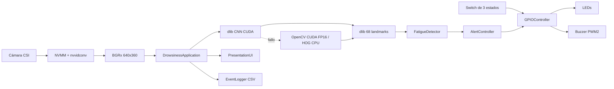

# TT2 Drowsiness Jetson V3

> **Detección de somnolencia optimizada para NVIDIA Jetson Nano, con calibración personal, interfaz en tiempo real y alertas GPIO.**

[](https://www.python.org/)
[](https://developer.nvidia.com/embedded/jetson-nano)
[](https://opencv.org/)
[](http://dlib.net/)
[](https://developer.nvidia.com/cuda-toolkit)
[](https://github.com/NVIDIA/jetson-gpio)

---

## 📌 Descripción general

**TT2 Drowsiness Jetson V3** es un sistema embebido para detectar señales de
somnolencia y distracción mediante una cámara CSI. Procesa video en tiempo real,
localiza el rostro y sus 68 puntos faciales, calcula métricas como **EAR**,
**MAR**, **PERCLOS**, pose de cabeza y dirección de mirada, y clasifica el nivel
de riesgo del usuario.

Está dirigido a proyectos académicos, prototipos de asistencia al conductor y
desarrolladores que trabajen con visión artificial en **NVIDIA Jetson Nano**.
Además de la interfaz visual, puede activar **LEDs**, un **buzzer pasivo PWM** y
un switch físico con modos automático, mantenimiento y paro de emergencia.

### Características principales

- Captura CSI por **NVMM/nvarguscamerasrc**, escalado con `nvvidconv` y salida
  **BGRx directa**, sin `videoconvert` en CPU.
- Detección facial primaria con **dlib CNN sobre CUDA**.
- Respaldos automáticos con **OpenCV DNN CUDA FP16** y **dlib HOG CPU**.
- Estimación de **68 landmarks** con dlib, conservando la calibración original.
- Cálculo de **EAR**, **MAR**, **PERCLOS**, mirada y pose de cabeza.
- Detección temporal de ojos cerrados, bostezos, cabeceo y pérdida de rostro.
- Estados escalonados: normal, prealerta, alerta y alerta crítica.
- Calibración supervisada de tres perfiles personales: **ojos abiertos**,
  **posible somnolencia** y **dormido**, durante la sesión.
- Interfaz OpenCV con métricas, landmarks, FPS y estado del hardware.
- Modos de operación **AUTOMATIC**, **MAINTENANCE** y **EMERGENCY**.
- Ejecución con GPIO físico o en modo completamente simulado.
- Alertas con LEDs y buzzer pasivo **MH-FMD/YL-44 low-level trigger**.
- PWM2 nativo para mantener el tono estable bajo carga de OpenCV y dlib.
- Pipeline **latest-only**: nunca procesa dos veces el mismo cuadro ni acumula
  video atrasado.
- Detección facial a media escala, seguimiento ligero por landmarks y
  redetección periódica.
- CLAHE adaptativo, pose/mirada desacopladas y PERCLOS incremental.
- Objetivo de análisis configurable de **20 FPS** y telemetría por etapa en la
  interfaz.
- Registro opcional de transiciones de estado en CSV.
- Pruebas unitarias de calibración, estados, GPIO/PWM y ruta optimizada.

---

## 🛠️ Stack tecnológico

| Categoría | Tecnología |
| :--- | :--- |
| **Backend / Core** | Python 3 |
| **Visión artificial** | OpenCV CUDA/DNN FP16, dlib CUDA/CNN, 68 landmarks, NumPy |
| **Captura de video** | Cámara CSI, NVMM, GStreamer, `nvarguscamerasrc`, `nvvidconv` |
| **Hardware** | NVIDIA Jetson Nano 4 GB, GPU Tegra X1, Jetson.GPIO, GPIO BOARD, PWM2 |
| **Interfaz** | Ventanas y overlays de OpenCV |
| **Servicios del sistema** | systemd, shell POSIX, sysfs PWM |
| **Pruebas** | `unittest`, `py_compile`, validación JSON |

---

## 🧩 Arquitectura



La descripción detallada de módulos, estados y flujo de ejecución se encuentra
en [DOCUMENTACION_PROYECTO.md](DOCUMENTACION_PROYECTO.md).

---

## ⚡ Rendimiento de la V3

La optimización conserva el predictor dlib de 68 puntos y todo el hardware de
la versión base. El trabajo se reduce en los lugares de mayor costo:

- Captura en hilo independiente con espera por secuencia y acceso sin copia.
- Salida BGRx directa desde `nvvidconv`; la conversión a BGR ocurre únicamente
  al dibujar la interfaz y no existe en modo headless.
- Detección CUDA a escala `0.5`, cada 3 análisis durante búsqueda y cada 12 con
  un rostro seguido, con cambio automático a un backend de respaldo si falla.
- Seguimiento del ROI mediante landmarks entre redetecciones.
- Pose y mirada cada 2 análisis, reutilizando el último valor válido.
- CLAHE únicamente cuando la luminosidad sale del rango configurado.
- Escrituras LED agrupadas, panel gráfico reutilizable y PERCLOS incremental.

Benchmark realizado en esta Jetson Nano, cámara CSI a procesamiento
**640×360**, escena sin rostro:

| Métrica | V2 | V3 acelerada | Cambio |
| :--- | ---: | ---: | ---: |
| FPS del analizador | 29.328 | 29.189 | **límite de cámara (~30 FPS)** |
| Latencia media | 11.267 ms | 10.526 ms | **−6.6 %** |
| Latencia p95 | 33.328 ms | 29.841 ms | **−10.5 %** |

Microbenchmark del detector, a media escala y sobre la misma Nano:

| Backend | Latencia media | Rendimiento equivalente |
| :--- | ---: | ---: |
| **dlib CNN CUDA** | **27.911 ms** | **35.828 FPS** |
| dlib HOG CPU | 30.578 ms | 32.704 FPS |
| OpenCV DNN CUDA FP16 | 36.850 ms | 27.137 FPS |
| OpenCV DNN CPU | 206.561 ms | 4.841 FPS |

La aplicación limita deliberadamente el análisis a **20 FPS** para reservar
CPU a la interfaz y a GPIO. Los resultados dependen de iluminación, presencia
del rostro, temperatura y modo de energía. Para repetir la medición:

```bash
python3 scripts/benchmark_pipeline.py --seconds 10 --warmup 2
```

---

## 🚀 Requisitos previos e instalación

### Requisitos de hardware

- **NVIDIA Jetson Nano 4 GB**.
- Cámara CSI compatible con `nvarguscamerasrc`, por ejemplo **IMX219-77IR**.
- Opcional: buzzer pasivo de tres pines **MH-FMD/YL-44 o YL-44**.
- Opcional: tres LEDs con resistencias de **220–330 Ω**.
- Opcional: switch físico **ON-OFF-ON** de tres posiciones.

### Requisitos de software

- **JetPack / L4T** instalado y funcional.
- **Python 3**.
- OpenCV compilado con **GStreamer, CUDA y cuDNN**.
- **dlib con CUDA**, **NumPy** y el runtime CUDA de JetPack.
- **Jetson.GPIO** para utilizar el hardware físico.
- `wget`, `bzip2` y `sha256sum` para instalar y verificar modelos.
- Modo de energía **MAXN** recomendado para benchmarks sostenidos.

> [!IMPORTANT]
> `requirements.txt` está vacío actualmente. En Jetson se recomienda conservar
> las versiones de OpenCV, NumPy y GStreamer proporcionadas por JetPack, en vez
> de sustituirlas indiscriminadamente con paquetes de `pip`.

### Pasos de instalación

1. **Clonar el repositorio:**

   ```bash
   git clone --branch v3 https://github.com/JFRo57/tt2_drowsiness_jetson.git tt2_drowsiness_jetson_v3
   cd tt2_drowsiness_jetson_v3
   ```

2. **Crear un entorno virtual reutilizando los paquetes de JetPack:**

   ```bash
   python3 -m venv --system-site-packages .venv
   source .venv/bin/activate
   ```

3. **Verificar las dependencias principales:**

   ```bash
   python3 -c "import cv2, dlib, numpy; print('OpenCV:', cv2.__version__, '| dlib:', dlib.__version__)"
   python3 -c "import Jetson.GPIO as GPIO; print('Jetson.GPIO:', GPIO.VERSION)"
   ```

4. **Instalar y verificar los modelos:**

   ```bash
   ./scripts/setup_v3_models.sh
   ```

   El script descarga el predictor de 68 landmarks, el detector CNN de dlib y
   los archivos del respaldo OpenCV DNN FP16. Verifica SHA-256 y los deja en
   `models/`, excluido de Git.

5. **Verificar aceleración y ejecutar:**

   ```bash
   python3 -c "import cv2,dlib; print('OpenCV CUDA:', cv2.cuda.getCudaEnabledDeviceCount()); print('dlib CUDA:', dlib.DLIB_USE_CUDA, dlib.cuda.get_num_devices())"
   python3 scripts/benchmark_accelerators.py
   python3 main.py --presentation --simulation
   ```

   En esta Nano, `auto` debe seleccionar `dlib_cnn_cuda`. Si CUDA o un modelo
   no están disponibles, el programa informa el motivo en el panel y continúa
   con `opencv_cuda_fp16` o `dlib_hog`.

---

## 🔌 Conexiones GPIO

El proyecto usa numeración física **BOARD**, no BCM.

| Función | Pin BOARD | Conexión |
| :--- | :---: | :--- |
| LED verde | 29 | Ánodo mediante resistencia de 220–330 Ω |
| LED amarillo | 31 | Ánodo mediante resistencia de 220–330 Ω |
| LED rojo | 32 | Ánodo mediante resistencia de 220–330 Ω |
| Buzzer pasivo | 33 | Pin `SIG` / `S` del módulo; función PWM2 |
| Switch automático | 35 | Extremo AUTO; activo hacia GND |
| Switch emergencia | 37 | Extremo EMERGENCY; activo hacia GND |
| Tierra común | GND | LEDs, buzzer y switch |

> [!CAUTION]
> Verifica voltajes, consumo, resistencias y pinout antes de energizar el
> circuito. No conectes una carga que exceda la corriente permitida por el GPIO.

---

## 🔊 Configuración de PWM2 y buzzer

El módulo probado es un buzzer pasivo **low-level trigger**: una salida **LOW**
lo activa y una salida **HIGH** lo silencia. Necesita una onda cuadrada de
aproximadamente **2–5 kHz**.

### 1. Habilitar PWM2 en Jetson-IO

```bash
sudo /opt/nvidia/jetson-io/jetson-io.py
```

Selecciona **`pwm2 (33)`**, guarda la configuración y reinicia la Jetson.

### 2. Instalar el inicializador incluido

En **L4T 32.7.6**, Jetson-IO puede mostrar PWM2 correctamente sin que BOARD 33
entregue todavía la señal física. El proyecto incluye un servicio que aplica el
pinmux necesario al arrancar y deja el buzzer en reposo HIGH:

```bash
sudo install -m 755 scripts/configure_pwm2_jetson_nano.sh /usr/local/sbin/tt2-configure-pwm2
sudo install -m 644 systemd/tt2-pwm2-pinmux.service /etc/systemd/system/
sudo systemctl daemon-reload
sudo systemctl enable --now tt2-pwm2-pinmux.service
```

### 3. Verificar PWM y GPIO

```bash
systemctl status tt2-pwm2-pinmux.service --no-pager
python3 main.py --gpio-self-test
```

La salida debe indicar **`Backend buzzer: PWM nativo`**, reproducir dos tonos y
quedar en silencio al finalizar.

### Por qué no se utiliza `PWM.stop()`

El backend controla PWM2 mediante `/sys/class/pwm`:

- **Tono:** ciclo de trabajo del 50 %.
- **Silencio:** ciclo de trabajo del 100 %, equivalente a salida HIGH.
- **Cleanup:** el canal queda habilitado en HIGH.

`Jetson.GPIO.PWM.stop()` puede dejar la salida en LOW y mantener este módulo
sonando. Por ello no debe utilizarse sobre BOARD 33 con este buzzer.

---

## ▶️ Ejecución

Activa siempre el entorno virtual independiente de esta versión:

```bash
cd /home/rafael/Documentos/tt2_drowsiness_jetson_v3
source .venv/bin/activate
```

### Interfaz con hardware simulado

```bash
python3 main.py --presentation --simulation
```

### Ejecución headless simulada

```bash
python3 main.py --headless --simulation
```

### Ejecución headless con GPIO físico

```bash
python3 main.py --headless
```

### Interfaz con GPIO físico

Configura `gpio.enabled: true` y `gpio.simulation_mode: false` en `config.json`:

```bash
python3 main.py --presentation
```

### Configuración personalizada

```bash
python3 main.py --config config.json --presentation
```

### Prueba exclusiva de GPIO

```bash
python3 main.py --gpio-self-test
```

---

## ⌨️ Controles de la interfaz

| Tecla | Acción |
| :---: | :--- |
| `1` | Modo automático simulado |
| `2` | Modo mantenimiento simulado |
| `3` | Paro de emergencia simulado |
| `O` | Calibrar perfil **ojos abiertos** |
| `S` | Calibrar perfil **posible somnolencia** |
| `D` | Calibrar perfil **dormido / ojos cerrados** |
| `C` | Alias compatible de `O` |
| `L` | Mostrar u ocultar landmarks |
| `I` | Mostrar u ocultar el panel de información |
| `M` | Silenciar o reactivar el buzzer |
| `P` | Pausar o reanudar la visualización |
| `R` | Reiniciar las métricas temporales |
| `Q` / `Esc` | Cerrar la aplicación |

### Calibración de los tres estados

Realiza la calibración con el vehículo detenido, la cámara en su posición final
y una iluminación similar a la de uso:

1. Presiona `O` y permanece aproximadamente 4 segundos mirando al frente, con
   los ojos abiertos y una postura normal.
2. Presiona `S` y simula posible somnolencia durante 4 segundos: párpados
   entrecerrados, expresión relajada y una inclinación ligera y natural.
3. Presiona `D` y mantén durante 4 segundos los ojos cerrados y la postura de
   cabeza que se desea reconocer como dormido.
4. Comprueba en el panel que aparezca `O:OK S:OK D:OK`. A partir de ese
   momento se muestran el perfil detectado, su confianza y su duración.

Las muestras con baja calidad se descartan. Los valores EAR deben quedar
separados en el orden abierto > somnoliento > dormido; si se superponen, el
sistema rechaza el conjunto para evitar un clasificador ambiguo.

**dlib no se reentrena:** continúa extrayendo los 68 landmarks. El clasificador
de sesión combina **EAR, MAR, pitch, yaw, roll y mirada** para comparar cada
frame con los tres perfiles personales. La calibración se mantiene en memoria,
por lo que debe repetirse al reiniciar el programa.

---

## ⚙️ Configuración principal

El archivo [config.json](config.json) centraliza la configuración de cámara,
dlib, fatiga, GPIO, buzzer, LEDs, switch, interfaz y logging.

La selección acelerada predeterminada es:

```json
{
  "face_detection": {
    "backend": "auto",
    "backend_order": ["dlib_cnn_cuda", "opencv_cuda_fp16", "dlib_hog"],
    "allow_fallback": true
  }
}
```

El panel muestra el backend realmente activo y la causa de cualquier fallback.
Para una prueba comparativa puede forzarse uno de los tres nombres en
`face_detection.backend`.

Para habilitar hardware real:

```json
{
  "gpio": {
    "enabled": true,
    "simulation_mode": false,
    "numbering": "BOARD"
  },
  "buzzer": {
    "enabled": true,
    "type": "pwm_native",
    "board_pin": 33,
    "active_high": false,
    "pwm_duty_cycle": 50,
    "pwm_chip": 0,
    "pwm_channel": 2,
    "min_frequency": 2000,
    "max_frequency": 5000
  }
}
```

Consulta [DOCUMENTACION_PROYECTO.md](DOCUMENTACION_PROYECTO.md) antes de
modificar umbrales temporales o parámetros de rendimiento.

---

## 🚨 Niveles de alerta

| Estado | Indicador | Buzzer |
| :--- | :--- | :--- |
| `NORMAL` / `PARPADEO` | LED verde | Apagado |
| `POSIBLE_SOMNOLENCIA` | LED amarillo intermitente | 2500 Hz, 3 pulsos |
| `ALERTA` | LED rojo intermitente | 3500 Hz, patrón recurrente |
| `ALERTA_CRITICA` | LED rojo rápido | 4500 Hz, patrón recurrente rápido |
| `MANTENIMIENTO` | LED amarillo fijo | Apagado |
| `PARO_EMERGENCIA` | LED rojo fijo | Apagado |

---

## ✅ Pruebas y validación

Ejecuta las pruebas unitarias:

```bash
python3 -m unittest discover -s tests -v
```

Valida sintaxis Python y configuración JSON:

```bash
python3 -m py_compile main.py src/*.py scripts/*.py tests/*.py
python3 -m json.tool config.json >/dev/null
```

Las pruebas GPIO unitarias utilizan un sysfs temporal y no activan el buzzer
físico. Para validar el hardware utiliza `--gpio-self-test`.

Para medir exclusivamente cámara y visión, sin interfaz ni GPIO:

```bash
python3 scripts/benchmark_pipeline.py --seconds 15
python3 scripts/benchmark_accelerators.py
```

---

## 📁 Estructura del proyecto

```text
tt2_drowsiness_jetson_v3/
├── main.py                         # Punto de entrada y argumentos CLI
├── config.json                     # Configuración principal
├── DOCUMENTACION_PROYECTO.md       # Documentación técnica completa
├── models/                         # Modelos locales verificados, no versionados
├── scripts/
│   ├── setup_v3_models.sh          # Descarga y verifica los modelos
│   ├── benchmark_accelerators.py   # Compara CPU, CUDA y FP16
│   ├── benchmark_pipeline.py       # Benchmark reproducible cámara + visión
│   └── configure_pwm2_jetson_nano.sh
├── src/
│   ├── application.py              # Orquestación de la aplicación
│   ├── camera.py                   # Captura CSI con GStreamer
│   ├── face_analyzer.py            # Rostro, landmarks y métricas
│   ├── face_detector.py            # Backend CUDA con fallback automático
│   ├── fatigue_detector.py         # Máquina de estados de fatiga
│   ├── alert_controller.py         # Patrones visuales y auditivos
│   ├── gpio_controller.py          # GPIO, PWM nativo y simulación
│   ├── mode_controller.py          # Modos de operación
│   ├── presentation_ui.py          # Interfaz OpenCV
│   └── event_logger.py             # Eventos CSV
├── systemd/
│   └── tt2-pwm2-pinmux.service
└── tests/
    ├── test_calibration.py
    ├── test_gpio_controller.py
    └── test_performance.py
```

---

## 🩺 Solución de problemas

### La cámara no abre

- Revisa el cable CSI y su orientación.
- Confirma que OpenCV tenga soporte GStreamer.
- Verifica `sensor_id` y `flip_method` en `config.json`.
- Comprueba que `nvarguscamerasrc` funcione fuera de la aplicación.

### No se encuentra el predictor facial

```bash
ls -lh models/shape_predictor_68_face_landmarks.dat
```

Ejecuta `./scripts/setup_v3_models.sh` para recuperar y verificar todos los
modelos. Si cambias su ubicación, actualiza las rutas en `config.json`.

### El panel muestra `dlib_hog` o un fallback

Comprueba primero:

```bash
python3 -c "import cv2,dlib; print(cv2.cuda.getCudaEnabledDeviceCount(), dlib.DLIB_USE_CUDA, dlib.cuda.get_num_devices())"
python3 scripts/benchmark_accelerators.py
```

El motivo exacto queda en `Fallback vision`. El backend HOG mantiene el sistema
operativo, pero indica que CUDA, cuDNN o un modelo no están disponibles.

### El buzzer solo hace “tic”

- Confirma que Jetson-IO tenga seleccionado **`pwm2 (33)`**.
- Instala y habilita `tt2-pwm2-pinmux.service`.
- Ejecuta `python3 main.py --gpio-self-test`.

### El buzzer no se apaga

El módulo es low-trigger. No uses `PWM.stop()` sobre BOARD 33; el estado de
reposo debe ser **HIGH**, implementado como PWM habilitado al 100 %.

### Hay falsas alertas

- Completa los tres perfiles con `O`, `S` y `D` hasta ver
  `O:OK S:OK D:OK`.
- Mejora la iluminación y el encuadre.
- Revisa `ear_threshold`, PERCLOS y los umbrales temporales.

---

## 🤝 Contribuciones

Las mejoras son bienvenidas. Antes de proponer cambios:

1. Crea una rama descriptiva.
2. Mantén separados el hardware real y los backends simulados.
3. Añade o actualiza pruebas cuando cambies GPIO/PWM.
4. Ejecuta la validación completa antes de abrir un pull request.

---

## 📄 Licencia

Este repositorio todavía no incluye una licencia de código abierto. Hasta que
se añada una, todos los derechos permanecen reservados por el autor.
