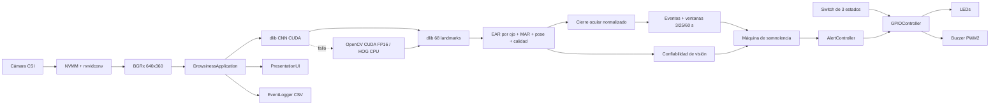

# TT2 Drowsiness Jetson V4

> **Detección de somnolencia optimizada para NVIDIA Jetson Nano, con calibración personal, interfaz en tiempo real y alertas GPIO.**

[](https://www.python.org/)
[](https://developer.nvidia.com/embedded/jetson-nano)
[](https://opencv.org/)
[](http://dlib.net/)
[](https://developer.nvidia.com/cuda-toolkit)
[](https://github.com/NVIDIA/jetson-gpio)

---

## 📌 Descripción general

**TT2 Drowsiness Jetson V4** es un sistema embebido para detectar señales de
somnolencia y distracción mediante una cámara CSI. Procesa video en tiempo real,
localiza el rostro y sus 68 puntos faciales, calcula métricas como **EAR**,
**MAR**, **PERCLOS**, pose de cabeza y dirección de mirada, y clasifica el nivel
de riesgo del usuario.

Está dirigido a proyectos académicos, prototipos de asistencia al conductor y
desarrolladores que trabajen con visión artificial en **NVIDIA Jetson Nano**.
Además de la interfaz visual, puede activar **LEDs**, un **buzzer pasivo PWM** y
un switch físico con modos automático, mantenimiento y paro de emergencia.

### Características principales

- Captura CSI por **NVMM/nvarguscamerasrc**, escalado con `nvvidconv` y salida
  **BGRx directa**, sin `videoconvert` en CPU.
- Detección facial primaria con **dlib CNN sobre CUDA**.
- Respaldos automáticos con **OpenCV DNN CUDA FP16** y **dlib HOG CPU**.
- Estimación de **68 landmarks** con dlib y estabilización temporal contra
  vibraciones del vehículo.
- Cálculo de **EAR**, **MAR**, **PERCLOS**, mirada y pose de cabeza.
- Eventos temporales completos de parpadeo, cierre sostenido, bostezo y cabeceo.
- Máquinas paralelas de somnolencia y confiabilidad de visión, con histéresis,
  recuperación pegajosa y salto crítico desde cualquier estado operativo.
- Calibración supervisada de **ojos normalmente abiertos**, **apertura ocular
  reducida** y **ojos completamente cerrados**, seguida de observación de
  parpadeos naturales.
- Umbrales EAR derivados de cada persona, sin asumir un tamaño o forma ocular
  universal.
- Mediana temporal, histéresis y validación por ojo; los datos inválidos no se
  convierten en ojos cerrados ni interrumpen un cierre ocular válido.
- Interfaz OpenCV con métricas, landmarks, FPS y estado del hardware.
- Modos de operación **AUTOMATIC**, **MAINTENANCE** y **EMERGENCY**.
- Ejecución con GPIO físico o en modo completamente simulado.
- Alertas con LEDs y buzzer pasivo **MH-FMD/YL-44 low-level trigger**.
- PWM2 nativo para mantener el tono estable bajo carga de OpenCV y dlib.
- Pipeline **latest-only**: nunca procesa dos veces el mismo cuadro ni acumula
  video atrasado.
- Detección facial a media escala, ROI suavizado y fusión de redetecciones sin
  saltos bruscos.
- CLAHE adaptativo, pose/mirada desacopladas y PERCLOS incremental.
- Objetivo de análisis configurable de **20 FPS** y telemetría por etapa en la
  interfaz.
- Perfil de calibración versionado y guardado de forma atómica, con migración
  segura de perfiles heredados compatibles.
- Registro CSV estructurado y amortiguado de transiciones, eventos y métricas.
- Pruebas unitarias de calibración, cierres críticos, visión degradada,
  multimodalidad, histéresis, GPIO/PWM y ruta optimizada.

---

## 🛠️ Stack tecnológico

| Categoría | Tecnología |
| :--- | :--- |
| **Backend / Core** | Python 3 |
| **Visión artificial** | OpenCV CUDA/DNN FP16, dlib CUDA/CNN, 68 landmarks, NumPy |
| **Captura de video** | Cámara CSI, NVMM, GStreamer, `nvarguscamerasrc`, `nvvidconv` |
| **Hardware** | NVIDIA Jetson Nano 4 GB, GPU Tegra X1, Jetson.GPIO, GPIO BOARD, PWM2 |
| **Interfaz** | Ventanas y overlays de OpenCV |
| **Servicios del sistema** | systemd, shell POSIX, sysfs PWM |
| **Pruebas** | `unittest`, `py_compile`, validación JSON |

---

## 🧩 Arquitectura



La descripción detallada de módulos, estados y flujo de ejecución se encuentra
en [DOCUMENTACION_PROYECTO.md](DOCUMENTACION_PROYECTO.md).

---

## ⚡ Rendimiento de la V4

La optimización conserva el predictor dlib de 68 puntos y todo el hardware de
la versión base. El trabajo se reduce en los lugares de mayor costo:

- Captura en hilo independiente con espera por secuencia y acceso sin copia.
- Salida BGRx directa desde `nvvidconv`; la conversión a BGR ocurre únicamente
  al dibujar la interfaz y no existe en modo headless.
- Detección CUDA a escala `0.5`, cada 3 análisis durante búsqueda y cada 12 con
  un rostro seguido, con cambio automático a un backend de respaldo si falla.
- Seguimiento del ROI mediante landmarks suavizados y fusión gradual de cada
  redetección CUDA.
- Pose y mirada cada 2 análisis, reutilizando el último valor válido.
- CLAHE únicamente cuando la luminosidad sale del rango configurado.
- Escrituras LED agrupadas, panel gráfico reutilizable y PERCLOS incremental.

Benchmark realizado en esta Jetson Nano, cámara CSI a procesamiento
**640×360**, escena sin rostro:

| Métrica V4 | Resultado |
| :--- | ---: |
| FPS del analizador | 29.189, limitado por cámara a ~30 FPS |
| Latencia media | 10.526 ms |
| Latencia p95 | 29.841 ms |

Microbenchmark del detector, a media escala y sobre la misma Nano:

| Backend | Latencia media | Rendimiento equivalente |
| :--- | ---: | ---: |
| **dlib CNN CUDA** | **27.911 ms** | **35.828 FPS** |
| dlib HOG CPU | 30.578 ms | 32.704 FPS |
| OpenCV DNN CUDA FP16 | 36.850 ms | 27.137 FPS |
| OpenCV DNN CPU | 206.561 ms | 4.841 FPS |

La aplicación limita deliberadamente el análisis a **20 FPS** para reservar
CPU a la interfaz y a GPIO. Los resultados dependen de iluminación, presencia
del rostro, temperatura y modo de energía. Para repetir la medición:

```bash
python3 scripts/benchmark_pipeline.py --seconds 10 --warmup 2
```

---

## 🚀 Requisitos previos e instalación

### Requisitos de hardware

- **NVIDIA Jetson Nano 4 GB**.
- Cámara CSI compatible con `nvarguscamerasrc`, por ejemplo **IMX219-77IR**.
- Opcional: buzzer pasivo de tres pines **MH-FMD/YL-44 o YL-44**.
- Opcional: tres LEDs con resistencias de **220–330 Ω**.
- Opcional: switch físico **ON-OFF-ON** de tres posiciones.

### Requisitos de software

- **JetPack / L4T** instalado y funcional.
- **Python 3**.
- OpenCV compilado con **GStreamer, CUDA y cuDNN**.
- **dlib con CUDA**, **NumPy** y el runtime CUDA de JetPack.
- **Jetson.GPIO** para utilizar el hardware físico.
- `wget`, `bzip2` y `sha256sum` para instalar y verificar modelos.
- Modo de energía **MAXN** recomendado para benchmarks sostenidos.

> [!IMPORTANT]
> `requirements.txt` está vacío actualmente. En Jetson se recomienda conservar
> las versiones de OpenCV, NumPy y GStreamer proporcionadas por JetPack, en vez
> de sustituirlas indiscriminadamente con paquetes de `pip`.

### Pasos de instalación

1. **Clonar el repositorio:**

   ```bash
   git clone --branch v4 https://github.com/JFRo57/tt2_drowsiness_jetson.git tt2_drowsiness_jetson_v4
   cd tt2_drowsiness_jetson_v4
   ```

2. **Crear un entorno virtual reutilizando los paquetes de JetPack:**

   ```bash
   python3 -m venv --system-site-packages .venv
   source .venv/bin/activate
   ```

3. **Verificar las dependencias principales:**

   ```bash
   python3 -c "import cv2, dlib, numpy; print('OpenCV:', cv2.__version__, '| dlib:', dlib.__version__)"
   python3 -c "import Jetson.GPIO as GPIO; print('Jetson.GPIO:', GPIO.VERSION)"
   ```

4. **Instalar y verificar los modelos:**

   ```bash
   ./scripts/setup_v3_models.sh
   ```

   El script descarga el predictor de 68 landmarks, el detector CNN de dlib y
   los archivos del respaldo OpenCV DNN FP16. Verifica SHA-256 y los deja en
   `models/`, excluido de Git.

5. **Verificar aceleración y ejecutar:**

   ```bash
   python3 -c "import cv2,dlib; print('OpenCV CUDA:', cv2.cuda.getCudaEnabledDeviceCount()); print('dlib CUDA:', dlib.DLIB_USE_CUDA, dlib.cuda.get_num_devices())"
   python3 scripts/benchmark_accelerators.py
   python3 main.py --presentation --simulation
   ```

   En esta Nano, `auto` debe seleccionar `dlib_cnn_cuda`. Si CUDA o un modelo
   no están disponibles, el programa informa el motivo en el panel y continúa
   con `opencv_cuda_fp16` o `dlib_hog`.

---

## 🔌 Conexiones GPIO

El proyecto usa numeración física **BOARD**, no BCM.

| Función | Pin BOARD | Conexión |
| :--- | :---: | :--- |
| LED verde | 29 | Ánodo mediante resistencia de 220–330 Ω |
| LED amarillo | 31 | Ánodo mediante resistencia de 220–330 Ω |
| LED rojo | 32 | Ánodo mediante resistencia de 220–330 Ω |
| Buzzer pasivo | 33 | Pin `SIG` / `S` del módulo; función PWM2 |
| Switch automático | 35 | Extremo AUTO; activo hacia GND |
| Switch emergencia | 37 | Extremo EMERGENCY; activo hacia GND |
| Tierra común | GND | LEDs, buzzer y switch |

> [!CAUTION]
> Verifica voltajes, consumo, resistencias y pinout antes de energizar el
> circuito. No conectes una carga que exceda la corriente permitida por el GPIO.

---

## 🔊 Configuración de PWM2 y buzzer

El módulo probado es un buzzer pasivo **low-level trigger**: una salida **LOW**
lo activa y una salida **HIGH** lo silencia. Necesita una onda cuadrada de
aproximadamente **2–5 kHz**.

### 1. Habilitar PWM2 en Jetson-IO

```bash
sudo /opt/nvidia/jetson-io/jetson-io.py
```

Selecciona **`pwm2 (33)`**, guarda la configuración y reinicia la Jetson.

### 2. Instalar el inicializador incluido

En **L4T 32.7.6**, Jetson-IO puede mostrar PWM2 correctamente sin que BOARD 33
entregue todavía la señal física. El proyecto incluye un servicio que aplica el
pinmux necesario al arrancar y deja el buzzer en reposo HIGH:

```bash
sudo install -m 755 scripts/configure_pwm2_jetson_nano.sh /usr/local/sbin/tt2-configure-pwm2
sudo install -m 644 systemd/tt2-pwm2-pinmux.service /etc/systemd/system/
sudo systemctl daemon-reload
sudo systemctl enable --now tt2-pwm2-pinmux.service
```

### 3. Verificar PWM y GPIO

```bash
systemctl status tt2-pwm2-pinmux.service --no-pager
python3 main.py --gpio-self-test
```

La salida debe indicar **`Backend buzzer: PWM nativo`**, reproducir dos tonos y
quedar en silencio al finalizar.

### Por qué no se utiliza `PWM.stop()`

El backend controla PWM2 mediante `/sys/class/pwm`:

- **Tono:** ciclo de trabajo del 50 %.
- **Silencio:** ciclo de trabajo del 100 %, equivalente a salida HIGH.
- **Cleanup:** el canal queda habilitado en HIGH.

`Jetson.GPIO.PWM.stop()` puede dejar la salida en LOW y mantener este módulo
sonando. Por ello no debe utilizarse sobre BOARD 33 con este buzzer.

---

## ▶️ Ejecución

Activa siempre el entorno virtual desde el checkout real donde tengas la rama
`v4`. En esta Jetson el repositorio ya existe en la carpeta histórica `v3`; la
rama cambió, pero Git no renombra el directorio:

```bash
cd /home/rafael/Documentos/tt2_drowsiness_jetson_v3
source .venv/bin/activate
```

### Interfaz con hardware simulado

```bash
python3 main.py --presentation --simulation
```

### Ejecución headless simulada

```bash
python3 main.py --headless --simulation
```

### Ejecución headless con GPIO físico

```bash
python3 main.py --headless
```

### Interfaz con GPIO físico

Configura `gpio.enabled: true` y `gpio.simulation_mode: false` en `config.json`:

```bash
python3 main.py --presentation
```

### Configuración personalizada

```bash
python3 main.py --config config.json --presentation
```

### Prueba exclusiva de GPIO

```bash
python3 main.py --gpio-self-test
```

### Diagnóstico completo de componentes

Para probar cada LED, los tonos de 2500/3500/4500 Hz y los patrones reales
sin abrir la cámara:

```bash
python3 scripts/test_components.py
```

También se puede aislar una sección o comprobar una posible polaridad
invertida en los LEDs:

```bash
python3 scripts/test_components.py --section leds --led-seconds 5
python3 scripts/test_components.py --section leds --led-active-low
python3 scripts/test_components.py --section buzzer
python3 scripts/test_components.py --section patterns
```

La lectura GPIO confirma el nivel solicitado por software; la presencia de
voltaje y el encendido físico deben verificarse visualmente o con multímetro.

### Sincronización de alertas con las salidas físicas

El estado calculado por el detector es la única fuente de verdad. Cada nivel
se envía en paralelo a la interfaz, los LEDs y el buzzer:

| Estado | LED físico | Buzzer |
|---|---|---|
| `ALERTA` | Verde continuo | Apagado |
| `SOSPECHA` | Amarillo intermitente | Aviso breve a 2500 Hz |
| `SOMNOLENCIA` | Rojo intermitente | Patrón a 3500 Hz |
| `CRITICO` | Rojo intermitente rápido | Patrón prioritario a 4500 Hz |
| `RECUPERACION` | Amarillo/rojo alterno | Apagado |
| Supervisión de cámara/rostro | Patrón amarillo distinto | Aviso a 3000 Hz |

La aplicación actualiza los patrones aunque la cámara tarde o pierda cuadros.
Cuando se solicita GPIO físico, un fallo de inicialización detiene el arranque
en vez de continuar silenciosamente en simulación. Además, la última orden se
reafirma cada `gpio.output_refresh_seconds` (0.5 s por defecto) para evitar que
la salida quede desincronizada del nivel de alerta. La interfaz sigue siendo
una representación alternativa y no controla los componentes.

---

## ⌨️ Controles de la interfaz

| Tecla | Acción |
| :---: | :--- |
| `1` | Modo automático simulado |
| `2` | Modo mantenimiento simulado |
| `3` | Paro de emergencia simulado |
| `O` | Calibrar perfil **ojos abiertos** |
| `S` | Repetir **apertura ocular reducida** |
| `D` | Repetir **ojos completamente cerrados** |
| `B` | Repetir observación dinámica de parpadeos |
| Click izquierdo / `Espacio` / `Enter` | Confirmar e iniciar la siguiente etapa de calibración |
| `C` | Reiniciar la calibración completa |
| `N` | Omitir la calibración y usar parámetros de respaldo durante esta sesión |
| `L` | Mostrar u ocultar landmarks |
| `I` | Mostrar u ocultar el panel de información |
| `V` | Activar o desactivar métricas de depuración |
| `M` | Silenciar o reactivar el buzzer |
| `P` | Pausar o reanudar la visualización |
| `R` | Reiniciar las métricas temporales |
| `Q` / `Esc` | Cerrar la aplicación |

### Calibración personalizada

Si no existe un perfil válido, el sistema muestra primero `CALIBRACIÓN REQUERIDA` y no inicia la captura ni el detector de fatiga. Haz click o presiona `Espacio`/`Enter` para comenzar. Presiona `N` para omitirla durante esa sesión y usar los parámetros de respaldo; esta omisión no se guarda como perfil.

Realiza la calibración con el vehículo detenido, la cámara en su posición final
y una iluminación similar a la de uso:

1. Pulsa `C`. Mira al frente con postura natural, ojos normalmente abiertos y
   sin exagerar la apertura durante la primera etapa.
2. Cuando se indique, mantén una apertura ocular reducida sin cerrar los ojos.
   Es una referencia geométrica intermedia, no una declaración de somnolencia.
3. Cierra los ojos de forma natural durante la tercera etapa.
4. Mira al frente con normalidad durante la observación dinámica. El sistema
   acepta únicamente ciclos abierto→cerrado→abierto. Si obtiene pocos eventos,
   solicitará de cinco a ocho parpadeos voluntarios normales como referencia
   secundaria.
5. El monitoreo comienza sólo cuando las etapas y el perfil completo son
   válidos. `O`, `S`, `D` y `B` permiten repetir únicamente la parte indicada.

Después de cada etapa aceptada aparece `CONFIRMAR`. Haz click izquierdo o
presiona `Espacio`/`Enter` cuando la persona ya esté lista para la etapa
siguiente. Luego aparece `PREPARANDO` durante `calibration.preparation_seconds`
(`2.0 s` por defecto); las muestras no se guardan hasta que la pantalla cambia
a `CALIBRANDO`.

La observación de parpadeos naturales y el respaldo de parpadeos voluntarios
normales duran `60 s` por defecto.

Cada etapa usa medianas izquierda, derecha y conjunta, dispersión, cobertura y
estabilidad de pose. Debe cumplirse abierto > reducido > cerrado por ojo, con
márgenes configurables y consistencia bilateral. Un fallo explica la etapa que
debe repetirse y nunca sobrescribe el último perfil válido.

La calibración es **individual**, no étnica: aprende la apertura ocular y la
postura de esa persona concreta. Esto cubre diferencias de párpado, tamaño de
ojo, lentes, distancia a cámara y posición habitual sin asignar umbrales por
origen. Debe repetirse si cambia el conductor, la cámara o los lentes.

> **Seguridad:** calibra siempre con el vehículo estacionado. Este proyecto es
> un prototipo de asistencia; una alarma no vuelve seguro continuar conduciendo
> con sueño y no sustituye detenerse en un lugar seguro. Una cámara no puede
> confirmar clínicamente un microsueño; valida cierres y alertas sólo en
> simulador, vehículo estacionado o entorno controlado.

**dlib no se reentrena:** continúa extrayendo los 68 landmarks. El cierre se
normaliza por ojo como `(EAR_abierto - EAR_actual) / (EAR_abierto -
EAR_cerrado)`, limitado a `[0,1]`. El perfil se guarda atómicamente en
`calibration_profile.json`; además se exportan los parámetros operativos a
`calibration_parameters.json`. En el siguiente arranque se reutilizan si su
versión y calidad son compatibles, sin repetir la calibración. Ambos archivos
son locales y no se versionan en Git.

---

## ⚙️ Configuración principal

El archivo [config.json](config.json) centraliza la configuración de cámara,
dlib, fatiga, GPIO, buzzer, LEDs, switch, interfaz y logging.

La selección acelerada predeterminada es:

```json
{
  "face_detection": {
    "backend": "auto",
    "backend_order": ["dlib_cnn_cuda", "opencv_cuda_fp16", "dlib_hog"],
    "allow_fallback": true
  }
}
```

El panel muestra el backend realmente activo y la causa de cualquier fallback.
Para una prueba comparativa puede forzarse uno de los tres nombres en
`face_detection.backend`.

Para habilitar hardware real:

```json
{
  "gpio": {
    "enabled": true,
    "simulation_mode": false,
    "numbering": "BOARD"
  },
  "buzzer": {
    "enabled": true,
    "type": "pwm_native",
    "board_pin": 33,
    "active_high": false,
    "pwm_duty_cycle": 50,
    "pwm_chip": 0,
    "pwm_channel": 2,
    "min_frequency": 2000,
    "max_frequency": 5000
  }
}
```

Consulta [DOCUMENTACION_PROYECTO.md](DOCUMENTACION_PROYECTO.md) antes de
modificar umbrales temporales o parámetros de rendimiento.

Los parámetros de `stability` controlan la robustez dentro del vehículo:

- `landmark_shape_alpha` y `landmark_translation_alpha` separan el suavizado de
  forma del seguimiento del movimiento global.
- `tracking_rect_alpha` y `redetection_rect_alpha` fusionan el ROI en el tiempo.
- `ear_median_window=3` elimina un outlier manteniendo baja latencia.
- `ear_hysteresis` separa los umbrales de cerrar y volver a abrir.
- `close_confirm_seconds=0.08` confirma rápido el cierre;
  `open_confirm_seconds=0.15` exige una apertura sostenida.
- `unreliable_hold_seconds` y `face_loss_hold_seconds` conservan brevemente el
  estado ante desenfoque o pérdida de rostro por vibración.
- `min_eye_sharpness`, `max_eye_ear_difference` y `max_eye_yaw_degrees`
  determinan cuándo una observación ocular es confiable.

Las secciones nuevas centralizan toda la decisión: `calibration` valida y
persiste el perfil; `fatigue` define niveles normalizados, ventanas, tiempos de
estado y fusión; `vision_reliability` controla pérdida de rostro, calidad y
FPS; `alerts` contiene tonos, ciclos y ritmos LED; `logging` configura
instantáneas y vaciado; `interface.debug_overlay` desactiva el panel detallado.
Los valores incluidos son parámetros iniciales de ingeniería para validación
controlada, no límites médicos ni certificación automotriz.

---

## 🚨 Niveles de alerta

| Estado | Indicador | Buzzer |
| :--- | :--- | :--- |
| `ALERTA` | LED verde | Apagado |
| `SOSPECHA` | LED amarillo intermitente | Aviso breve a 2500 Hz |
| `SOMNOLENCIA` | LED rojo intermitente | Patrón recurrente a 3500 Hz |
| `CRITICO` | LED rojo rápido | Patrón prioritario a 4500 Hz |
| `RECUPERACION` | Amarillo/rojo alterno | Apagado |
| `ROSTRO_NO_VISIBLE` / fallo de cámara | Patrón de supervisión | 3000 Hz |
| `MANTENIMIENTO` | LED amarillo fijo | Apagado |
| `PARO_EMERGENCIA` | LED rojo fijo | Apagado |

---

## ✅ Pruebas y validación

Ejecuta las pruebas unitarias:

```bash
python3 -m unittest discover -s tests -v
```

Valida sintaxis Python y configuración JSON:

```bash
python3 -m py_compile main.py src/*.py scripts/*.py tests/*.py
python3 -m json.tool config.json >/dev/null
```

Las pruebas GPIO unitarias utilizan un sysfs temporal y no activan el buzzer
físico. Para validar el hardware utiliza `--gpio-self-test`.

La suite cubre calibración personal y perfiles heredados, eventos oculares,
apertura reducida, cierres críticos, multimodalidad, visión degradada, pérdida
de rostro, FPS variable, PERCLOS con cobertura, recuperación/recaída,
histéresis, prioridades de alerta, GPIO/PWM y la ruta optimizada.

Para medir exclusivamente cámara y visión, sin interfaz ni GPIO:

```bash
python3 scripts/benchmark_pipeline.py --seconds 15
python3 scripts/benchmark_accelerators.py
```

---

## 📁 Estructura del proyecto

```text
tt2_drowsiness_jetson_v4/
├── main.py                         # Punto de entrada y argumentos CLI
├── config.json                     # Configuración principal
├── DOCUMENTACION_PROYECTO.md       # Documentación técnica completa
├── models/                         # Modelos locales verificados, no versionados
├── scripts/
│   ├── setup_v3_models.sh          # Descarga y verifica los modelos
│   ├── benchmark_accelerators.py   # Compara CPU, CUDA y FP16
│   ├── benchmark_pipeline.py       # Benchmark reproducible cámara + visión
│   ├── test_components.py          # Prueba física de LEDs, tonos y patrones
│   └── configure_pwm2_jetson_nano.sh
├── src/
│   ├── application.py              # Orquestación de la aplicación
│   ├── camera.py                   # Captura CSI con GStreamer
│   ├── face_analyzer.py            # Rostro, landmarks y métricas
│   ├── face_detector.py            # Backend CUDA con fallback automático
│   ├── fatigue_detector.py         # Máquina de estados de fatiga
│   ├── temporal_events.py           # Normalización, eventos y ventanas
│   ├── vision_reliability.py        # Máquina paralela de confiabilidad
│   ├── alert_controller.py         # Patrones visuales y auditivos
│   ├── gpio_controller.py          # GPIO, PWM nativo y simulación
│   ├── mode_controller.py          # Modos de operación
│   ├── presentation_ui.py          # Interfaz OpenCV
│   └── event_logger.py             # Eventos CSV
├── systemd/
│   └── tt2-pwm2-pinmux.service
└── tests/
    ├── test_application_outputs.py
    ├── test_calibration.py
    ├── test_temporal_state_machine.py
    ├── test_alert_controller.py
    ├── test_event_logger.py
    ├── test_component_tester.py
    ├── test_gpio_controller.py
    └── test_performance.py
```

---

## 🩺 Solución de problemas

### La cámara no abre

- Revisa el cable CSI y su orientación.
- Confirma que OpenCV tenga soporte GStreamer.
- Verifica `sensor_id` y `flip_method` en `config.json`.
- Comprueba que `nvarguscamerasrc` funcione fuera de la aplicación.

### No se encuentra el predictor facial

```bash
ls -lh models/shape_predictor_68_face_landmarks.dat
```

Ejecuta `./scripts/setup_v3_models.sh` para recuperar y verificar todos los
modelos. Si cambias su ubicación, actualiza las rutas en `config.json`.

### El panel muestra `dlib_hog` o un fallback

Comprueba primero:

```bash
python3 -c "import cv2,dlib; print(cv2.cuda.getCudaEnabledDeviceCount(), dlib.DLIB_USE_CUDA, dlib.cuda.get_num_devices())"
python3 scripts/benchmark_accelerators.py
```

El motivo exacto queda en `Fallback vision`. El backend HOG mantiene el sistema
operativo, pero indica que CUDA, cuDNN o un modelo no están disponibles.

### El buzzer solo hace “tic”

- Confirma que Jetson-IO tenga seleccionado **`pwm2 (33)`**.
- Instala y habilita `tt2-pwm2-pinmux.service`.
- Ejecuta `python3 main.py --gpio-self-test`.

### El buzzer no se apaga

El módulo es low-trigger. No uses `PWM.stop()` sobre BOARD 33; el estado de
reposo debe ser **HIGH**, implementado como PWM habilitado al 100 %.

### Hay falsas alertas

- Ejecuta `C` y completa las tres etapas más la observación de parpadeos.
- Compara en el panel **EAR crudo** y **EAR filtrado**, y revisa el estado de
  señal ocular. `RETENIDO` ocasional es normal; `NO_CONFIABLE` frecuente indica
  desenfoque, giro lateral, oclusión o encuadre insuficiente.
- Si la nitidez ocular es baja, fija mejor la cámara, mejora la iluminación y
  reduce reflejos en lentes antes de modificar umbrales.
- Repite la calibración con el vehículo detenido cuando cambien conductor,
  cámara, asiento o lentes.
- Ajusta `stability` únicamente después de observar o registrar el problema.
  No copies `ear_threshold` entre personas ni lo uses como primera corrección:
  con `use_session_calibration=true` es solo el respaldo previo a calibrar.

La cámara y los landmarks no siempre pueden diferenciar una cámara tapada de
un asiento vacío, ni un bostezo de todas las actividades de boca posibles. La
máquina reduce esos falsos positivos mediante calidad, ciclos completos,
duración y fusión multimodal, pero estas limitaciones requieren validación
física en el montaje final.

---

## 🤝 Contribuciones

Las mejoras son bienvenidas. Antes de proponer cambios:

1. Crea una rama descriptiva.
2. Mantén separados el hardware real y los backends simulados.
3. Añade o actualiza pruebas cuando cambies GPIO/PWM.
4. Ejecuta la validación completa antes de abrir un pull request.

---

## 📄 Licencia

Este repositorio todavía no incluye una licencia de código abierto. Hasta que
se añada una, todos los derechos permanecen reservados por el autor.
